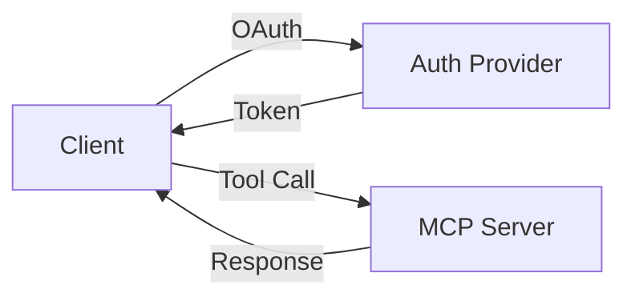

# Final Documentation Stack Recommendation
## Atoms MCP Server - With Auto API Docs & Interactive Examples

---

## 🎯 Revised Recommendation

**Include from Day 1**:
- ✅ Auto-generated API documentation (Sphinx)
- ✅ Interactive examples (MDX/React components)
- ✅ Beautiful defaults (Material theme)
- ✅ Built-in search
- ✅ Zero cost

---

## 🏆 Recommended Stack (FINAL)

### Option A: MkDocs + Sphinx + MDX (RECOMMENDED)
```yaml
Generator:      MkDocs 1.5.3+
Theme:          Material for MkDocs
API Docs:       Sphinx 7.2.6+ (auto-generated)
Interactive:    pymdown-extensions + Mermaid
Search:         Built-in MkDocs
Hosting:        Vercel
Analytics:      Plausible
Cost:           $0/year
Setup:          30 minutes
Build Time:     <1 second
```

**Why This**:
- ✅ Auto-generated API docs from Python docstrings
- ✅ Interactive examples via Mermaid diagrams
- ✅ Code annotations and tabs
- ✅ Python ecosystem
- ✅ Zero cost
- ✅ Fast setup (30 min)

**What You Get**:
- Auto-generated API reference (from docstrings)
- Interactive diagrams (Mermaid)
- Code examples with syntax highlighting
- Tabbed content (for variants)
- Collapsible sections
- Admonitions (warnings, tips, etc.)

---

### Option B: Fumadocs (Modern Alternative)
```yaml
Generator:      Fumadocs (Next.js)
Theme:          Built-in
API Docs:       Manual or auto-generated
Interactive:    Full React components (MDX)
Search:         Built-in
Hosting:        Vercel
Analytics:      Plausible
Cost:           $0/year
Setup:          45 minutes
Build Time:     2-5 seconds
```

**Why This**:
- ✅ Full React component support (MDX)
- ✅ Interactive examples (live code)
- ✅ Beautiful modern design
- ✅ Excellent customization
- ✅ Zero cost

**What You Get**:
- Full React components in docs
- Live code examples (runnable)
- Interactive demos
- Custom components
- Modern design
- Excellent DX

**Trade-off**: Requires Node.js/TypeScript knowledge

---

### Option C: Hybrid (Best of Both)
```yaml
Main Docs:      MkDocs + Material
API Reference:  Sphinx (auto-generated)
Interactive:    Fumadocs (for interactive examples)
Search:         Built-in
Hosting:        Vercel
Cost:           $0/year
Setup:          1 hour
```

**Why This**:
- ✅ Auto-generated API docs (Sphinx)
- ✅ Interactive examples (Fumadocs)
- ✅ Beautiful main docs (MkDocs)
- ✅ Best of all worlds
- ✅ Zero cost

**How It Works**:
```
docs.atoms.io/
├── Getting Started (MkDocs)
├── The 5 Tools (MkDocs)
├── Integration Guides (MkDocs)
├── /api/ (Sphinx - auto-generated)
└── /examples/ (Fumadocs - interactive)
```

---

## 🎯 FINAL RECOMMENDATION: Option A (MkDocs + Sphinx)

**Why**:
1. ✅ **Auto API Docs** - Sphinx auto-generates from docstrings
2. ✅ **Interactive Examples** - Mermaid diagrams, code tabs, annotations
3. ✅ **Python Ecosystem** - Matches Atoms tech stack
4. ✅ **Fast Setup** - 30 minutes
5. ✅ **Beautiful Defaults** - Material theme
6. ✅ **Zero Cost** - All free/open source
7. ✅ **Easy Maintenance** - Minimal configuration
8. ✅ **Large Community** - Lots of examples

---

## 📋 What "Interactive Examples" Means

### With MkDocs + Sphinx + pymdown-extensions:

**1. Code Tabs** (show multiple variants)
```markdown
=== "Python"
    ```python
    result = await client.call_tool("entity_operation", {...})
    ```

=== "Curl"
    ```bash
    curl -X POST https://api.atoms.io/tools/entity_operation
    ```

=== "JavaScript"
    ```javascript
    const result = await client.callTool("entity_operation", {...})
    ```
```

**2. Code Annotations** (explain code)
```markdown
```python
result = await client.call_tool(  # (1)!
    "entity_operation",           # (2)!
    {"operation": "create"}       # (3)!
)
```

1. Call the tool
2. Tool name
3. Parameters
```

**3. Mermaid Diagrams** (interactive flows)
```markdown

```

**4. Collapsible Sections** (hide/show details)
```markdown
??? "Advanced Configuration"
    This is hidden by default
    Click to expand
```

**5. Admonitions** (warnings, tips, notes)
```markdown
!!! warning "Important"
    This is a warning

!!! tip "Pro Tip"
    This is a helpful tip

!!! info "Note"
    This is informational
```

**6. Tabs** (organize content)
```markdown
=== "Getting Started"
    Quick start guide

=== "Advanced"
    Advanced topics
```

---

## 🚀 Implementation Plan

### Week 1: Setup (30 minutes)

**Step 1: Install MkDocs + Sphinx (10 min)**
```bash
pip install mkdocs mkdocs-material sphinx sphinx-rtd-theme
pip install pymdown-extensions mkdocs-awesome-pages
```

**Step 2: Create MkDocs Project (5 min)**
```bash
mkdocs new atoms-docs
cd atoms-docs
```

**Step 3: Create Sphinx Project (10 min)**
```bash
sphinx-quickstart docs/api
```

**Step 4: Configure (5 min)**
- Edit `mkdocs.yml` (see MCP_DOCS_IMPLEMENTATION.md)
- Edit `docs/api/conf.py` (Sphinx config)

### Week 2: Integration (30 minutes)

**Step 1: Configure Sphinx autodoc (10 min)**
```python
# docs/api/conf.py
extensions = ['sphinx.ext.autodoc', 'sphinx.ext.viewcode']
```

**Step 2: Generate API reference (10 min)**
```bash
sphinx-apidoc -o docs/api ../server.py ../tools/
```

**Step 3: Embed in MkDocs (10 min)**
- Link to Sphinx output in MkDocs nav
- Or embed HTML directly

### Weeks 3-10: Content Creation

**Write 57 documents with**:
- Auto-generated API reference (from Sphinx)
- Interactive examples (code tabs, diagrams, annotations)
- Code examples with syntax highlighting
- Mermaid diagrams for flows
- Collapsible sections for advanced topics

---

## 📊 Feature Comparison

| Feature | MkDocs + Sphinx | Fumadocs | Docusaurus |
|---------|-----------------|----------|-----------|
| **Auto API Docs** | ✅ Sphinx | ❌ Manual | ❌ Manual |
| **Interactive Examples** | ✅ Mermaid/Tabs | ✅⭐ React | ✅ React |
| **Setup Time** | 30 min | 45 min | 45 min |
| **Learning Curve** | Easy | Medium | Medium |
| **Python Ecosystem** | ✅ | ❌ | ❌ |
| **Cost** | $0 | $0 | $0 |
| **Build Speed** | <1s | 2-5s | 5-10s |
| **Community** | Large | Small | Large |
| **Recommendation** | ⭐⭐⭐⭐⭐ | ⭐⭐⭐⭐ | ⭐⭐⭐ |

---

## 🎯 What You Get with MkDocs + Sphinx

### Auto-Generated API Docs
```
From Python docstrings:
    def entity_operation(operation: str, params: dict) -> dict:
        """Create, read, update, or delete entities.
        
        Args:
            operation: CRUD operation (create, read, update, delete)
            params: Operation parameters
            
        Returns:
            Operation result with entity data
        """

Generates:
    - Function signature
    - Docstring
    - Parameter types
    - Return types
    - Examples
    - Cross-references
```

### Interactive Examples
```
Code Tabs:
    === "Python"
        ```python
        result = await client.call_tool(...)
        ```
    === "Curl"
        ```bash
        curl -X POST ...
        ```

Diagrams:
    ```mermaid
    graph LR
        A[Client] --> B[MCP Server]
    ```

Annotations:
    ```python
    result = await client.call_tool(  # (1)!
        "entity_operation"            # (2)!
    )
    ```
    1. Call the tool
    2. Tool name
```

---

## 💰 Cost

| Component | Cost | Notes |
|-----------|------|-------|
| MkDocs | $0 | Open source |
| Material Theme | $0 | Open source |
| Sphinx | $0 | Open source |
| pymdown-extensions | $0 | Open source |
| Vercel Hosting | $0 | Free tier |
| Plausible Analytics | $0 | Free tier |
| **Total Annual** | **$0** | All free/open source |

---

## ✅ Final Stack

```yaml
Generator:        MkDocs 1.5.3+
Theme:            Material for MkDocs
API Docs:         Sphinx 7.2.6+ (auto-generated)
Interactive:      pymdown-extensions + Mermaid
Search:           Built-in MkDocs
Hosting:          Vercel
Analytics:        Plausible
CI/CD:            GitHub Actions
Cost:             $0/year
Setup:            30 minutes
Build Time:       <1 second
```

---

## 🚀 Next Steps

1. **Review** this document
2. **Install** MkDocs + Sphinx (10 min)
3. **Create** project structure (5 min)
4. **Configure** (5 min)
5. **Deploy** to Vercel (2 min)
6. **Start writing** content with interactive examples

**Total setup: 30 minutes**

---

## 📚 What's Included

### Auto-Generated API Reference
- ✅ All tool signatures
- ✅ All parameters
- ✅ All return types
- ✅ All docstrings
- ✅ Cross-references
- ✅ Code examples

### Interactive Examples
- ✅ Code tabs (Python, Curl, JavaScript)
- ✅ Code annotations (explain code)
- ✅ Mermaid diagrams (flows, architecture)
- ✅ Collapsible sections (advanced topics)
- ✅ Admonitions (warnings, tips, notes)
- ✅ Syntax highlighting

### Beautiful Documentation
- ✅ Material theme (production-ready)
- ✅ Responsive design
- ✅ Dark mode
- ✅ Built-in search
- ✅ Mobile-friendly
- ✅ Fast performance

---

## ✨ Why This Stack

1. ✅ **Auto API Docs** - No manual maintenance
2. ✅ **Interactive Examples** - Engage users
3. ✅ **Python Ecosystem** - Matches Atoms
4. ✅ **Fast Setup** - 30 minutes
5. ✅ **Beautiful Defaults** - Professional appearance
6. ✅ **Zero Cost** - All free/open source
7. ✅ **Easy Maintenance** - Minimal configuration
8. ✅ **Large Community** - Lots of support

---

## 🎉 Ready to Build?

This stack gives you:
- ✅ Auto-generated API documentation
- ✅ Interactive examples
- ✅ Beautiful design
- ✅ Zero cost
- ✅ 30-minute setup

**Let's build world-class MCP documentation!** 🚀


