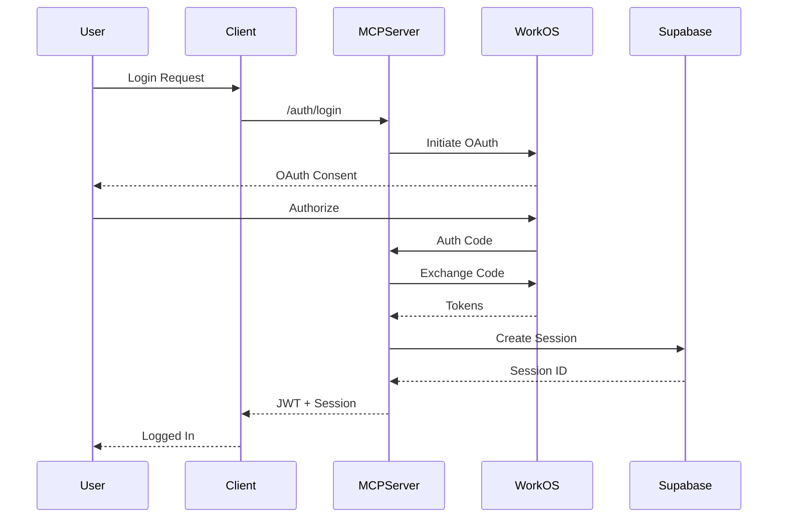
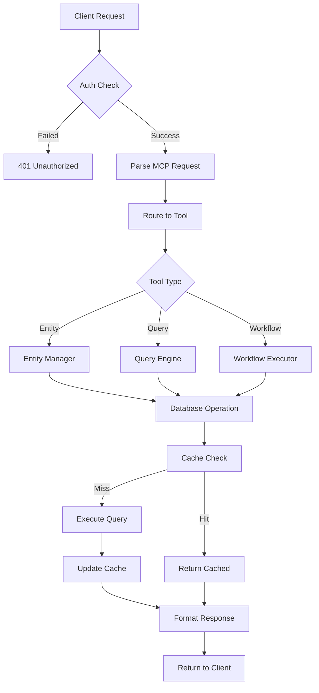

# Integration Guide for Atoms MCP Server

## Overview

This comprehensive guide explains how all components of the Atoms MCP Server work together across Phase 2-5 implementations. It covers data flows, integration points, configuration examples, and troubleshooting procedures for a complete production deployment.

---

## Table of Contents

1. [System Architecture](#system-architecture)
2. [Component Integration](#component-integration)
3. [Data Flow Diagrams](#data-flow-diagrams)
4. [Integration Points](#integration-points)
5. [Configuration Examples](#configuration-examples)
6. [API Integration](#api-integration)
7. [Database Integration](#database-integration)
8. [Authentication Flow](#authentication-flow)
9. [Session Management](#session-management)
10. [Troubleshooting Guide](#troubleshooting-guide)

---

## 1. System Architecture

### 1.1 High-Level Architecture

```
┌─────────────────────────────────────────────────────────────────────────┐
│                              Client Applications                          │
│                    (Web App, CLI, SDK, Third-party Tools)                │
└─────────────┬──────────────────────────────────────────┬────────────────┘
              │                                          │
              ▼                                          ▼
┌──────────────────────────────────────────────────────────────────────────┐
│                            Vercel Edge Network                            │
│                         (CDN, DDoS Protection, SSL)                       │
└─────────────┬──────────────────────────────────────────┬────────────────┘
              │                                          │
              ▼                                          ▼
┌──────────────────────────────────────────────────────────────────────────┐
│                        Atoms MCP Server (FastAPI)                         │
├──────────────────────────────────────────────────────────────────────────┤
│  ┌────────────────┐  ┌────────────────┐  ┌────────────────┐            │
│  │ Auth Middleware│  │  Rate Limiter  │  │  CORS Handler  │            │
│  └────────┬───────┘  └────────┬───────┘  └────────┬───────┘            │
│           │                    │                    │                    │
│  ┌────────▼──────────────────────────────────────────┐                  │
│  │               Request Router (FastMCP)              │                  │
│  └────────┬──────────────────────────────────────────┘                  │
│           │                                                              │
│  ┌────────▼────────┬──────────────┬──────────────┬──────────────┐      │
│  │   Tool Layer    │ Entity Mgmt   │ Query Engine │ Workflow Mgr │      │
│  └────────┬────────┴──────────────┴──────────────┴──────────────┘      │
│           │                                                              │
│  ┌────────▼──────────────────────────────────────────┐                  │
│  │            Data Access Layer (DAL)                 │                  │
│  └────────┬──────────────────────────────────────────┘                  │
└───────────┼──────────────────────────────────────────────────────────────┘
            │
            ▼
┌──────────────────────────────────────────────────────────────────────────┐
│                         External Services                                 │
├─────────────────────┬────────────────────┬──────────────────────────────┤
│     Supabase DB     │    WorkOS Auth     │    Google Cloud AI           │
│  (PostgreSQL + RLS) │    (AuthKit)       │    (Embeddings)             │
└─────────────────────┴────────────────────┴──────────────────────────────┘
```

### 1.2 Component Layers

```python
# Layer definitions and responsibilities

LAYERS = {
    "presentation": {
        "components": ["API Endpoints", "WebSocket Handlers", "GraphQL Resolvers"],
        "responsibilities": ["Request validation", "Response formatting", "Protocol handling"]
    },
    "business": {
        "components": ["Tool Executors", "Entity Managers", "Workflow Engines"],
        "responsibilities": ["Business logic", "Validation rules", "Process orchestration"]
    },
    "data": {
        "components": ["DAL", "Cache Layer", "Query Builders"],
        "responsibilities": ["Data persistence", "Caching", "Query optimization"]
    },
    "infrastructure": {
        "components": ["Database", "Cache", "Message Queue", "File Storage"],
        "responsibilities": ["Data storage", "Performance", "Scalability"]
    }
}
```

---

## 2. Component Integration

### 2.1 Core Components Map

```yaml
components:
  authentication:
    provider: WorkOS AuthKit
    integration: FastMCP Auth Middleware
    session_store: Supabase
    token_type: JWT (RS256)

  api_gateway:
    framework: FastAPI
    protocol: HTTP/WebSocket
    transport: FastMCP
    deployment: Vercel Serverless

  database:
    primary: Supabase (PostgreSQL)
    cache: Redis (via Vercel KV)
    embeddings: PostgreSQL pgvector
    search: PostgreSQL full-text

  tools:
    entity_management: lib/atoms/entity.py
    query_engine: tools/query.py
    relationship_manager: tools/relationship.py
    workflow_executor: tools/workflow.py

  monitoring:
    logs: Vercel Logs
    metrics: Custom telemetry
    alerts: Webhook notifications
    tracing: OpenTelemetry
```

### 2.2 Component Dependencies

```python
# Dependency injection configuration
from typing import Dict, Any
from fastapi import Depends
from lib.atoms import AtomsClient
from tools.base import BaseTool

class DependencyContainer:
    """Central dependency injection container"""

    def __init__(self):
        self._dependencies: Dict[str, Any] = {}
        self._singletons: Dict[str, Any] = {}

    def register(self, name: str, factory, singleton: bool = False):
        """Register a dependency"""
        self._dependencies[name] = factory
        if singleton:
            self._singletons[name] = None

    def resolve(self, name: str):
        """Resolve a dependency"""
        if name in self._singletons:
            if self._singletons[name] is None:
                self._singletons[name] = self._dependencies[name]()
            return self._singletons[name]
        return self._dependencies[name]()

# Initialize container
container = DependencyContainer()

# Register dependencies
container.register("atoms_client", lambda: AtomsClient(), singleton=True)
container.register("entity_tool", lambda: EntityTool(container.resolve("atoms_client")))
container.register("query_tool", lambda: QueryTool(container.resolve("atoms_client")))

# Usage in FastAPI
async def get_atoms_client() -> AtomsClient:
    return container.resolve("atoms_client")

@app.get("/api/entities")
async def list_entities(client: AtomsClient = Depends(get_atoms_client)):
    return await client.list_entities()
```

---

## 3. Data Flow Diagrams

### 3.1 Authentication Flow



### 3.2 Tool Execution Flow



### 3.3 Session Management Flow

```python
# Session lifecycle management
from datetime import datetime, timedelta
from typing import Optional
import hashlib
import secrets

class SessionManager:
    """Manages user sessions across the application"""

    def __init__(self, storage, ttl_hours: int = 24):
        self.storage = storage
        self.ttl = timedelta(hours=ttl_hours)

    async def create_session(
        self,
        user_id: str,
        token: str,
        device_info: Dict[str, str]
    ) -> str:
        """Create a new session"""
        session_id = secrets.token_urlsafe(32)
        token_hash = hashlib.sha256(token.encode()).hexdigest()

        session_data = {
            "id": session_id,
            "user_id": user_id,
            "token_hash": token_hash,
            "created_at": datetime.utcnow(),
            "expires_at": datetime.utcnow() + self.ttl,
            "last_activity": datetime.utcnow(),
            "device_info": device_info,
            "is_active": True
        }

        await self.storage.save_session(session_id, session_data)
        return session_id

    async def validate_session(self, session_id: str, token: str) -> bool:
        """Validate an existing session"""
        session = await self.storage.get_session(session_id)

        if not session:
            return False

        # Check expiration
        if datetime.utcnow() > session["expires_at"]:
            await self.revoke_session(session_id, "expired")
            return False

        # Verify token
        token_hash = hashlib.sha256(token.encode()).hexdigest()
        if token_hash != session["token_hash"]:
            return False

        # Update last activity
        await self.touch_session(session_id)
        return True

    async def touch_session(self, session_id: str):
        """Update session last activity"""
        await self.storage.update_session(
            session_id,
            {"last_activity": datetime.utcnow()}
        )

    async def revoke_session(self, session_id: str, reason: str):
        """Revoke a session"""
        await self.storage.update_session(
            session_id,
            {
                "is_active": False,
                "revoked_at": datetime.utcnow(),
                "revocation_reason": reason
            }
        )
```

---

## 4. Integration Points

### 4.1 API Integration Points

```python
# API endpoint registration
from fastapi import FastAPI, APIRouter
from typing import Dict, List

class APIRegistry:
    """Central API endpoint registry"""

    def __init__(self, app: FastAPI):
        self.app = app
        self.routers: Dict[str, APIRouter] = {}

    def register_router(self, prefix: str, router: APIRouter, tags: List[str]):
        """Register an API router"""
        self.routers[prefix] = router
        self.app.include_router(router, prefix=prefix, tags=tags)

    def get_endpoints(self) -> Dict[str, List[str]]:
        """Get all registered endpoints"""
        endpoints = {}
        for route in self.app.routes:
            if hasattr(route, "methods"):
                path = route.path
                methods = list(route.methods)
                endpoints[path] = methods
        return endpoints

# Initialize registry
api_registry = APIRegistry(app)

# Register routers
from tools.entity import entity_router
from tools.query import query_router
from tools.workflow import workflow_router

api_registry.register_router("/api/entities", entity_router, ["entities"])
api_registry.register_router("/api/queries", query_router, ["queries"])
api_registry.register_router("/api/workflows", workflow_router, ["workflows"])
```

### 4.2 Database Integration Points

```python
# Database connection management
from contextlib import asynccontextmanager
from typing import AsyncGenerator
import asyncpg
from supabase import create_client

class DatabaseManager:
    """Manages database connections and transactions"""

    def __init__(self, config: Dict[str, str]):
        self.supabase = create_client(
            config["SUPABASE_URL"],
            config["SUPABASE_SERVICE_KEY"]
        )
        self.pool = None

    async def initialize(self):
        """Initialize connection pool"""
        self.pool = await asyncpg.create_pool(
            dsn=self._build_dsn(),
            min_size=5,
            max_size=20,
            command_timeout=60
        )

    @asynccontextmanager
    async def transaction(self) -> AsyncGenerator:
        """Provide a database transaction"""
        async with self.pool.acquire() as connection:
            async with connection.transaction():
                yield connection

    async def execute_query(self, query: str, *args):
        """Execute a single query"""
        async with self.pool.acquire() as connection:
            return await connection.fetch(query, *args)

    async def execute_batch(self, queries: List[Tuple[str, tuple]]):
        """Execute multiple queries in a transaction"""
        async with self.transaction() as conn:
            results = []
            for query, params in queries:
                result = await conn.fetch(query, *params)
                results.append(result)
            return results

# Usage
db_manager = DatabaseManager(config)
await db_manager.initialize()

# Execute queries
results = await db_manager.execute_query(
    "SELECT * FROM atoms_entities WHERE workspace_id = $1",
    workspace_id
)
```

### 4.3 Cache Integration

```python
# Multi-level cache implementation
from typing import Optional, Any
import json
import hashlib
from datetime import datetime, timedelta

class CacheManager:
    """Multi-level cache manager"""

    def __init__(self, redis_client, local_cache_size: int = 1000):
        self.redis = redis_client
        self.local_cache = {}
        self.local_cache_size = local_cache_size
        self.access_times = {}

    def _generate_key(self, namespace: str, key: str) -> str:
        """Generate cache key"""
        return f"{namespace}:{hashlib.md5(key.encode()).hexdigest()}"

    async def get(
        self,
        namespace: str,
        key: str,
        use_local: bool = True
    ) -> Optional[Any]:
        """Get from cache"""
        cache_key = self._generate_key(namespace, key)

        # Check local cache first
        if use_local and cache_key in self.local_cache:
            self.access_times[cache_key] = datetime.utcnow()
            return self.local_cache[cache_key]

        # Check Redis
        value = await self.redis.get(cache_key)
        if value:
            parsed = json.loads(value)
            # Update local cache
            if use_local:
                self._update_local_cache(cache_key, parsed)
            return parsed

        return None

    async def set(
        self,
        namespace: str,
        key: str,
        value: Any,
        ttl_seconds: int = 300,
        use_local: bool = True
    ):
        """Set in cache"""
        cache_key = self._generate_key(namespace, key)
        serialized = json.dumps(value)

        # Set in Redis
        await self.redis.setex(cache_key, ttl_seconds, serialized)

        # Set in local cache
        if use_local:
            self._update_local_cache(cache_key, value)

    def _update_local_cache(self, key: str, value: Any):
        """Update local cache with LRU eviction"""
        if len(self.local_cache) >= self.local_cache_size:
            # Evict least recently used
            lru_key = min(self.access_times, key=self.access_times.get)
            del self.local_cache[lru_key]
            del self.access_times[lru_key]

        self.local_cache[key] = value
        self.access_times[key] = datetime.utcnow()

    async def invalidate(self, namespace: str, key: str = None):
        """Invalidate cache entries"""
        if key:
            cache_key = self._generate_key(namespace, key)
            await self.redis.delete(cache_key)
            self.local_cache.pop(cache_key, None)
            self.access_times.pop(cache_key, None)
        else:
            # Invalidate entire namespace
            pattern = f"{namespace}:*"
            keys = await self.redis.keys(pattern)
            if keys:
                await self.redis.delete(*keys)
            # Clear local cache for namespace
            to_remove = [k for k in self.local_cache if k.startswith(namespace)]
            for k in to_remove:
                del self.local_cache[k]
                del self.access_times[k]
```

---

## 5. Configuration Examples

### 5.1 Complete Application Configuration

```python
# config.py - Application configuration
from pydantic import BaseSettings, Field
from typing import Optional, Dict, Any
import os

class Settings(BaseSettings):
    """Application settings with validation"""

    # Environment
    environment: str = Field(default="development", env="ENVIRONMENT")
    debug: bool = Field(default=False, env="DEBUG")
    log_level: str = Field(default="INFO", env="LOG_LEVEL")

    # Server
    host: str = Field(default="0.0.0.0", env="HOST")
    port: int = Field(default=8000, env="PORT")
    workers: int = Field(default=4, env="WORKERS")

    # FastMCP
    fastmcp_transport: str = Field(default="http", env="ATOMS_FASTMCP_TRANSPORT")
    fastmcp_http_path: str = Field(default="/api/mcp", env="ATOMS_FASTMCP_HTTP_PATH")
    fastmcp_auth_mode: str = Field(default="required", env="ATOMS_FASTMCP_HTTP_AUTH_MODE")

    # Database
    database_url: str = Field(..., env="DATABASE_URL")
    database_pool_size: int = Field(default=20, env="DB_POOL_SIZE")
    database_pool_timeout: int = Field(default=10, env="DB_POOL_TIMEOUT")

    # Supabase
    supabase_url: str = Field(..., env="NEXT_PUBLIC_SUPABASE_URL")
    supabase_anon_key: str = Field(..., env="NEXT_PUBLIC_SUPABASE_ANON_KEY")
    supabase_service_key: str = Field(..., env="SUPABASE_SERVICE_ROLE_KEY")

    # WorkOS
    workos_api_key: str = Field(..., env="WORKOS_API_KEY")
    workos_client_id: str = Field(..., env="WORKOS_CLIENT_ID")
    workos_redirect_uri: str = Field(..., env="WORKOS_REDIRECT_URI")

    # Cache
    cache_enabled: bool = Field(default=True, env="CACHE_ENABLED")
    cache_ttl_seconds: int = Field(default=300, env="CACHE_TTL_SECONDS")
    cache_max_size_mb: int = Field(default=100, env="CACHE_MAX_SIZE_MB")

    # Rate Limiting
    rate_limit_enabled: bool = Field(default=True, env="RATE_LIMIT_ENABLED")
    rate_limit_requests: int = Field(default=60, env="RATE_LIMIT_REQUESTS_PER_MINUTE")
    rate_limit_burst: int = Field(default=100, env="RATE_LIMIT_BURST_SIZE")

    # Session
    session_ttl_hours: int = Field(default=24, env="MCP_SESSION_TTL_HOURS")
    session_cleanup_interval: int = Field(default=30, env="SESSION_CLEANUP_INTERVAL_MINUTES")
    max_sessions_per_user: int = Field(default=10, env="MAX_SESSIONS_PER_USER")

    # Google Cloud
    gcp_project: Optional[str] = Field(None, env="GOOGLE_CLOUD_PROJECT")
    gcp_location: str = Field(default="us-central1", env="GOOGLE_CLOUD_LOCATION")
    vertex_model: str = Field(default="text-embedding-004", env="VERTEX_EMBEDDINGS_MODEL")

    class Config:
        env_file = ".env"
        case_sensitive = False

    def get_database_config(self) -> Dict[str, Any]:
        """Get database configuration"""
        return {
            "url": self.database_url,
            "pool_size": self.database_pool_size,
            "timeout": self.database_pool_timeout,
        }

    def get_cache_config(self) -> Dict[str, Any]:
        """Get cache configuration"""
        return {
            "enabled": self.cache_enabled,
            "ttl": self.cache_ttl_seconds,
            "max_size_mb": self.cache_max_size_mb,
        }

# Load settings
settings = Settings()
```

### 5.2 Tool Configuration

```python
# tools/config.py - Tool-specific configuration
from typing import Dict, Any, Optional
from dataclasses import dataclass

@dataclass
class ToolConfig:
    """Configuration for individual tools"""
    name: str
    description: str
    version: str
    enabled: bool = True
    rate_limit: Optional[int] = None
    cache_ttl: Optional[int] = None
    requires_auth: bool = True
    permissions: list = None

# Tool configurations
TOOL_CONFIGS = {
    "entity_create": ToolConfig(
        name="entity_create",
        description="Create a new entity in the workspace",
        version="1.0.0",
        enabled=True,
        rate_limit=100,
        cache_ttl=0,  # Don't cache creates
        requires_auth=True,
        permissions=["workspace:write"]
    ),
    "entity_list": ToolConfig(
        name="entity_list",
        description="List entities in the workspace",
        version="1.0.0",
        enabled=True,
        rate_limit=1000,
        cache_ttl=60,
        requires_auth=True,
        permissions=["workspace:read"]
    ),
    "query_execute": ToolConfig(
        name="query_execute",
        description="Execute a query against the workspace",
        version="1.0.0",
        enabled=True,
        rate_limit=500,
        cache_ttl=300,
        requires_auth=True,
        permissions=["workspace:read"]
    ),
    "workflow_run": ToolConfig(
        name="workflow_run",
        description="Execute a workflow",
        version="1.0.0",
        enabled=True,
        rate_limit=50,
        cache_ttl=0,
        requires_auth=True,
        permissions=["workflow:execute"]
    )
}

def get_tool_config(tool_name: str) -> Optional[ToolConfig]:
    """Get configuration for a specific tool"""
    return TOOL_CONFIGS.get(tool_name)

def is_tool_enabled(tool_name: str) -> bool:
    """Check if a tool is enabled"""
    config = get_tool_config(tool_name)
    return config.enabled if config else False
```

---

## 6. API Integration

### 6.1 MCP Protocol Implementation

```python
# mcp/protocol.py - MCP protocol handler
from typing import Dict, Any, Optional, List
from dataclasses import dataclass
import json

@dataclass
class MCPRequest:
    """MCP request structure"""
    jsonrpc: str = "2.0"
    method: str = None
    params: Dict[str, Any] = None
    id: Optional[str] = None

@dataclass
class MCPResponse:
    """MCP response structure"""
    jsonrpc: str = "2.0"
    result: Optional[Any] = None
    error: Optional[Dict[str, Any]] = None
    id: Optional[str] = None

class MCPProtocolHandler:
    """Handles MCP protocol communication"""

    def __init__(self, tool_registry):
        self.tool_registry = tool_registry

    async def handle_request(self, raw_request: str) -> str:
        """Handle an MCP request"""
        try:
            # Parse request
            data = json.loads(raw_request)
            request = MCPRequest(**data)

            # Route to appropriate handler
            if request.method == "tools/list":
                result = await self._handle_list_tools()
            elif request.method == "tools/call":
                result = await self._handle_tool_call(request.params)
            else:
                raise ValueError(f"Unknown method: {request.method}")

            # Build response
            response = MCPResponse(
                id=request.id,
                result=result
            )

        except Exception as e:
            response = MCPResponse(
                id=request.id if 'request' in locals() else None,
                error={
                    "code": -32603,
                    "message": str(e)
                }
            )

        return json.dumps(response.__dict__)

    async def _handle_list_tools(self) -> List[Dict[str, Any]]:
        """List available tools"""
        tools = []
        for name, tool in self.tool_registry.tools.items():
            if tool.config.enabled:
                tools.append({
                    "name": name,
                    "description": tool.config.description,
                    "inputSchema": tool.get_input_schema()
                })
        return {"tools": tools}

    async def _handle_tool_call(self, params: Dict[str, Any]) -> Any:
        """Execute a tool"""
        tool_name = params.get("name")
        tool_args = params.get("arguments", {})

        tool = self.tool_registry.get_tool(tool_name)
        if not tool:
            raise ValueError(f"Tool not found: {tool_name}")

        return await tool.execute(**tool_args)
```

### 6.2 RESTful API Wrapper

```python
# api/rest.py - REST API wrapper for MCP
from fastapi import APIRouter, HTTPException, Depends
from typing import Dict, Any
import json

router = APIRouter(prefix="/api/v1")

@router.post("/tools/{tool_name}")
async def execute_tool(
    tool_name: str,
    params: Dict[str, Any],
    mcp_handler: MCPProtocolHandler = Depends(get_mcp_handler)
):
    """REST endpoint for tool execution"""
    # Build MCP request
    mcp_request = {
        "jsonrpc": "2.0",
        "method": "tools/call",
        "params": {
            "name": tool_name,
            "arguments": params
        },
        "id": str(uuid.uuid4())
    }

    # Execute through MCP handler
    response_str = await mcp_handler.handle_request(json.dumps(mcp_request))
    response = json.loads(response_str)

    # Check for errors
    if "error" in response:
        raise HTTPException(
            status_code=400,
            detail=response["error"]["message"]
        )

    return response["result"]

@router.get("/tools")
async def list_tools(
    mcp_handler: MCPProtocolHandler = Depends(get_mcp_handler)
):
    """List available tools"""
    mcp_request = {
        "jsonrpc": "2.0",
        "method": "tools/list",
        "id": str(uuid.uuid4())
    }

    response_str = await mcp_handler.handle_request(json.dumps(mcp_request))
    response = json.loads(response_str)

    return response["result"]
```

---

## 7. Database Integration

### 7.1 Entity Storage Layer

```sql
-- Entity storage schema with versioning
CREATE TABLE atoms_entities (
    id UUID PRIMARY KEY DEFAULT uuid_generate_v4(),
    workspace_id UUID NOT NULL REFERENCES atoms_workspaces(id),
    type TEXT NOT NULL,
    name TEXT NOT NULL,
    metadata JSONB DEFAULT '{}',
    embedding vector(768),  -- For semantic search
    search_vector tsvector,  -- For full-text search
    version INTEGER DEFAULT 1,
    created_at TIMESTAMP WITH TIME ZONE DEFAULT NOW(),
    updated_at TIMESTAMP WITH TIME ZONE DEFAULT NOW(),
    created_by UUID REFERENCES atoms_users(id),
    updated_by UUID REFERENCES atoms_users(id),
    is_deleted BOOLEAN DEFAULT FALSE,
    deleted_at TIMESTAMP WITH TIME ZONE
);

-- Indexes for performance
CREATE INDEX idx_entities_workspace ON atoms_entities(workspace_id) WHERE NOT is_deleted;
CREATE INDEX idx_entities_type ON atoms_entities(type) WHERE NOT is_deleted;
CREATE INDEX idx_entities_search ON atoms_entities USING GIN(search_vector);
CREATE INDEX idx_entities_embedding ON atoms_entities USING ivfflat(embedding vector_cosine_ops);

-- Update search vector trigger
CREATE FUNCTION update_entity_search_vector() RETURNS trigger AS $$
BEGIN
    NEW.search_vector := to_tsvector('english',
        COALESCE(NEW.name, '') || ' ' ||
        COALESCE(NEW.type, '') || ' ' ||
        COALESCE(NEW.metadata::text, '')
    );
    RETURN NEW;
END;
$$ LANGUAGE plpgsql;

CREATE TRIGGER entity_search_vector_update
    BEFORE INSERT OR UPDATE ON atoms_entities
    FOR EACH ROW
    EXECUTE FUNCTION update_entity_search_vector();
```

### 7.2 Query Optimization

```python
# database/optimizer.py - Query optimization
from typing import List, Dict, Any, Optional
import asyncpg

class QueryOptimizer:
    """Optimizes database queries"""

    def __init__(self, connection_pool):
        self.pool = connection_pool
        self.query_cache = {}

    async def analyze_query_plan(self, query: str, params: tuple) -> Dict[str, Any]:
        """Analyze query execution plan"""
        async with self.pool.acquire() as conn:
            plan = await conn.fetch(
                f"EXPLAIN (ANALYZE, BUFFERS, FORMAT JSON) {query}",
                *params
            )
            return plan[0]["QUERY PLAN"]

    def optimize_filters(self, filters: List[Dict[str, Any]]) -> str:
        """Optimize WHERE clause filters"""
        conditions = []
        params = []
        param_count = 1

        for filter_item in filters:
            field = filter_item["field"]
            operator = filter_item["operator"]
            value = filter_item["value"]

            if operator == "in":
                placeholders = ", ".join(
                    f"${i}" for i in range(param_count, param_count + len(value))
                )
                conditions.append(f"{field} = ANY(ARRAY[{placeholders}])")
                params.extend(value)
                param_count += len(value)
            else:
                conditions.append(f"{field} {operator} ${param_count}")
                params.append(value)
                param_count += 1

        where_clause = " AND ".join(conditions) if conditions else "1=1"
        return where_clause, params

    async def batch_query(
        self,
        base_query: str,
        batch_params: List[tuple],
        batch_size: int = 100
    ) -> List[List[asyncpg.Record]]:
        """Execute queries in batches"""
        results = []

        for i in range(0, len(batch_params), batch_size):
            batch = batch_params[i:i + batch_size]

            async with self.pool.acquire() as conn:
                batch_results = await conn.fetch_many(
                    [base_query] * len(batch),
                    batch
                )
                results.extend(batch_results)

        return results
```

---

## 8. Authentication Flow

### 8.1 OAuth Flow Implementation

```python
# auth/oauth.py - OAuth implementation
from typing import Optional, Dict, Any
import httpx
import jwt
from datetime import datetime, timedelta

class OAuthProvider:
    """OAuth provider integration"""

    def __init__(self, config: Dict[str, str]):
        self.client_id = config["client_id"]
        self.client_secret = config["client_secret"]
        self.redirect_uri = config["redirect_uri"]
        self.auth_url = config["auth_url"]
        self.token_url = config["token_url"]

    def get_authorization_url(self, state: str) -> str:
        """Generate authorization URL"""
        params = {
            "client_id": self.client_id,
            "redirect_uri": self.redirect_uri,
            "response_type": "code",
            "scope": "openid profile email",
            "state": state
        }
        return f"{self.auth_url}?" + "&".join(f"{k}={v}" for k, v in params.items())

    async def exchange_code(self, code: str) -> Dict[str, Any]:
        """Exchange authorization code for tokens"""
        async with httpx.AsyncClient() as client:
            response = await client.post(
                self.token_url,
                data={
                    "grant_type": "authorization_code",
                    "code": code,
                    "client_id": self.client_id,
                    "client_secret": self.client_secret,
                    "redirect_uri": self.redirect_uri
                }
            )
            response.raise_for_status()
            return response.json()

    async def refresh_token(self, refresh_token: str) -> Dict[str, Any]:
        """Refresh access token"""
        async with httpx.AsyncClient() as client:
            response = await client.post(
                self.token_url,
                data={
                    "grant_type": "refresh_token",
                    "refresh_token": refresh_token,
                    "client_id": self.client_id,
                    "client_secret": self.client_secret
                }
            )
            response.raise_for_status()
            return response.json()

    def verify_token(self, token: str, public_key: str) -> Dict[str, Any]:
        """Verify and decode JWT token"""
        try:
            payload = jwt.decode(
                token,
                public_key,
                algorithms=["RS256"],
                audience=self.client_id,
                options={"verify_exp": True}
            )
            return payload
        except jwt.ExpiredSignatureError:
            raise ValueError("Token has expired")
        except jwt.InvalidTokenError as e:
            raise ValueError(f"Invalid token: {e}")
```

### 8.2 Session Management Integration

```python
# auth/session.py - Session management
from typing import Optional, Dict, Any
import uuid
from datetime import datetime, timedelta

class SessionService:
    """Manages user sessions"""

    def __init__(self, db_manager, cache_manager, config):
        self.db = db_manager
        self.cache = cache_manager
        self.ttl = timedelta(hours=config.session_ttl_hours)
        self.max_sessions = config.max_sessions_per_user

    async def create_session(
        self,
        user_id: str,
        token_data: Dict[str, Any],
        device_info: Dict[str, Any]
    ) -> str:
        """Create a new session"""
        # Check session limit
        await self._enforce_session_limit(user_id)

        session_id = str(uuid.uuid4())
        expires_at = datetime.utcnow() + self.ttl

        # Store in database
        await self.db.execute_query(
            """
            INSERT INTO atoms_sessions
            (id, user_id, token_hash, expires_at, metadata, created_at, last_activity)
            VALUES ($1, $2, $3, $4, $5, $6, $7)
            """,
            session_id,
            user_id,
            self._hash_token(token_data["access_token"]),
            expires_at,
            json.dumps({
                "device_info": device_info,
                "token_data": {
                    "scope": token_data.get("scope"),
                    "token_type": token_data.get("token_type")
                }
            }),
            datetime.utcnow(),
            datetime.utcnow()
        )

        # Cache session data
        await self.cache.set(
            "sessions",
            session_id,
            {
                "user_id": user_id,
                "expires_at": expires_at.isoformat(),
                "device_info": device_info
            },
            ttl_seconds=int(self.ttl.total_seconds())
        )

        return session_id

    async def validate_session(
        self,
        session_id: str,
        token: str
    ) -> Optional[Dict[str, Any]]:
        """Validate a session"""
        # Check cache first
        cached = await self.cache.get("sessions", session_id)
        if cached:
            if datetime.fromisoformat(cached["expires_at"]) > datetime.utcnow():
                return cached

        # Check database
        result = await self.db.execute_query(
            """
            SELECT user_id, expires_at, metadata
            FROM atoms_sessions
            WHERE id = $1 AND token_hash = $2 AND expires_at > NOW()
            """,
            session_id,
            self._hash_token(token)
        )

        if result:
            session_data = dict(result[0])
            # Update cache
            await self.cache.set(
                "sessions",
                session_id,
                session_data,
                ttl_seconds=300
            )
            # Update last activity
            await self._touch_session(session_id)
            return session_data

        return None

    async def _enforce_session_limit(self, user_id: str):
        """Enforce maximum sessions per user"""
        sessions = await self.db.execute_query(
            """
            SELECT id, created_at
            FROM atoms_sessions
            WHERE user_id = $1 AND expires_at > NOW()
            ORDER BY created_at DESC
            """,
            user_id
        )

        if len(sessions) >= self.max_sessions:
            # Revoke oldest sessions
            to_revoke = sessions[self.max_sessions - 1:]
            for session in to_revoke:
                await self.revoke_session(session["id"], "session_limit_exceeded")
```

---

## 9. Session Management

### 9.1 Token Refresh Implementation

```python
# session/refresh.py - Token refresh service
from typing import Optional, Dict, Any
from datetime import datetime, timedelta
import asyncio

class TokenRefreshService:
    """Handles token refresh operations"""

    def __init__(self, oauth_provider, session_service):
        self.oauth = oauth_provider
        self.sessions = session_service
        self.refresh_tasks = {}

    async def start_auto_refresh(self, session_id: str, refresh_token: str):
        """Start automatic token refresh for a session"""
        if session_id in self.refresh_tasks:
            self.refresh_tasks[session_id].cancel()

        task = asyncio.create_task(
            self._auto_refresh_loop(session_id, refresh_token)
        )
        self.refresh_tasks[session_id] = task

    async def _auto_refresh_loop(self, session_id: str, refresh_token: str):
        """Auto-refresh loop for a session"""
        while True:
            try:
                # Wait until token is about to expire (refresh 5 minutes before)
                await asyncio.sleep(3300)  # 55 minutes

                # Refresh the token
                new_tokens = await self.oauth.refresh_token(refresh_token)

                # Update session
                await self.sessions.update_session_tokens(
                    session_id,
                    new_tokens
                )

                # Update refresh token for next iteration
                refresh_token = new_tokens.get("refresh_token", refresh_token)

            except asyncio.CancelledError:
                break
            except Exception as e:
                logger.error(f"Token refresh failed for session {session_id}: {e}")
                break

    def stop_auto_refresh(self, session_id: str):
        """Stop automatic token refresh for a session"""
        if session_id in self.refresh_tasks:
            self.refresh_tasks[session_id].cancel()
            del self.refresh_tasks[session_id]
```

---

## 10. Troubleshooting Guide

### 10.1 Common Issues and Solutions

```python
# troubleshooting/diagnostics.py
from typing import Dict, List, Any
import asyncio
import httpx

class DiagnosticService:
    """Service for diagnosing common issues"""

    def __init__(self, config):
        self.config = config
        self.checks = {
            "database": self.check_database,
            "auth": self.check_auth,
            "cache": self.check_cache,
            "api": self.check_api,
            "network": self.check_network
        }

    async def run_diagnostics(self) -> Dict[str, Any]:
        """Run all diagnostic checks"""
        results = {}

        for name, check_func in self.checks.items():
            try:
                result = await check_func()
                results[name] = {
                    "status": "ok" if result["success"] else "error",
                    "details": result
                }
            except Exception as e:
                results[name] = {
                    "status": "error",
                    "error": str(e)
                }

        return results

    async def check_database(self) -> Dict[str, Any]:
        """Check database connectivity"""
        try:
            from supabase import create_client
            client = create_client(
                self.config.supabase_url,
                self.config.supabase_service_key
            )

            # Test query
            result = client.table("atoms_workspaces").select("id").limit(1).execute()

            return {
                "success": True,
                "message": "Database connection successful"
            }
        except Exception as e:
            return {
                "success": False,
                "message": f"Database connection failed: {e}",
                "troubleshooting": [
                    "Check SUPABASE_URL is correct",
                    "Verify SUPABASE_SERVICE_ROLE_KEY is valid",
                    "Ensure database is accessible from your network",
                    "Check if tables are properly migrated"
                ]
            }

    async def check_auth(self) -> Dict[str, Any]:
        """Check authentication service"""
        try:
            async with httpx.AsyncClient() as client:
                response = await client.get(
                    f"{self.config.workos_auth_url}/.well-known/openid-configuration"
                )
                response.raise_for_status()

            return {
                "success": True,
                "message": "Auth service is accessible"
            }
        except Exception as e:
            return {
                "success": False,
                "message": f"Auth service check failed: {e}",
                "troubleshooting": [
                    "Verify WORKOS_API_KEY is set",
                    "Check WORKOS_CLIENT_ID is correct",
                    "Ensure WorkOS dashboard is configured",
                    "Verify redirect URLs are whitelisted"
                ]
            }

    async def check_cache(self) -> Dict[str, Any]:
        """Check cache connectivity"""
        try:
            # Test cache operations
            test_key = "diagnostic_test"
            test_value = "test_value"

            await self.cache.set(test_key, test_value)
            retrieved = await self.cache.get(test_key)

            if retrieved != test_value:
                raise ValueError("Cache value mismatch")

            await self.cache.delete(test_key)

            return {
                "success": True,
                "message": "Cache operations successful"
            }
        except Exception as e:
            return {
                "success": False,
                "message": f"Cache check failed: {e}",
                "troubleshooting": [
                    "Check Redis/cache service is running",
                    "Verify cache connection settings",
                    "Ensure sufficient memory available",
                    "Check network connectivity to cache"
                ]
            }
```

### 10.2 Debug Utilities

```python
# debug/utils.py - Debugging utilities
import inspect
import traceback
from functools import wraps
import time

def debug_trace(func):
    """Decorator to trace function calls"""
    @wraps(func)
    async def wrapper(*args, **kwargs):
        start_time = time.time()
        function_name = func.__name__
        module_name = func.__module__

        # Log entry
        logger.debug(
            f"Entering {module_name}.{function_name}",
            extra={
                "args": str(args)[:200],
                "kwargs": str(kwargs)[:200]
            }
        )

        try:
            result = await func(*args, **kwargs)
            elapsed = time.time() - start_time

            # Log successful exit
            logger.debug(
                f"Exiting {module_name}.{function_name}",
                extra={
                    "elapsed_ms": elapsed * 1000,
                    "result_type": type(result).__name__
                }
            )

            return result

        except Exception as e:
            elapsed = time.time() - start_time

            # Log error
            logger.error(
                f"Error in {module_name}.{function_name}",
                extra={
                    "elapsed_ms": elapsed * 1000,
                    "error": str(e),
                    "traceback": traceback.format_exc()
                }
            )
            raise

    return wrapper

class RequestDebugger:
    """Debug HTTP requests and responses"""

    def __init__(self, enabled: bool = False):
        self.enabled = enabled
        self.request_log = []

    async def log_request(self, request):
        """Log incoming request"""
        if not self.enabled:
            return

        debug_info = {
            "timestamp": datetime.utcnow().isoformat(),
            "method": request.method,
            "path": request.url.path,
            "headers": dict(request.headers),
            "query_params": dict(request.query_params)
        }

        if request.method in ["POST", "PUT", "PATCH"]:
            try:
                body = await request.body()
                debug_info["body"] = body.decode("utf-8")[:1000]
            except:
                debug_info["body"] = "Could not decode body"

        self.request_log.append(debug_info)
        logger.debug("Request received", extra=debug_info)

    def get_recent_requests(self, limit: int = 10) -> List[Dict]:
        """Get recent requests for debugging"""
        return self.request_log[-limit:]
```

### 10.3 Error Recovery Patterns

```python
# recovery/patterns.py - Error recovery implementations
from typing import Any, Callable
import asyncio
from functools import wraps

class CircuitBreaker:
    """Circuit breaker pattern for fault tolerance"""

    def __init__(
        self,
        failure_threshold: int = 5,
        recovery_timeout: int = 60,
        expected_exception: type = Exception
    ):
        self.failure_threshold = failure_threshold
        self.recovery_timeout = recovery_timeout
        self.expected_exception = expected_exception
        self.failure_count = 0
        self.last_failure_time = None
        self.state = "closed"  # closed, open, half-open

    async def call(self, func: Callable, *args, **kwargs) -> Any:
        """Execute function with circuit breaker"""
        if self.state == "open":
            if self._should_attempt_reset():
                self.state = "half-open"
            else:
                raise Exception("Circuit breaker is open")

        try:
            result = await func(*args, **kwargs)
            self._on_success()
            return result
        except self.expected_exception as e:
            self._on_failure()
            raise

    def _should_attempt_reset(self) -> bool:
        """Check if we should try to reset the circuit"""
        if self.last_failure_time is None:
            return False

        time_since_failure = time.time() - self.last_failure_time
        return time_since_failure >= self.recovery_timeout

    def _on_success(self):
        """Handle successful call"""
        self.failure_count = 0
        self.state = "closed"

    def _on_failure(self):
        """Handle failed call"""
        self.failure_count += 1
        self.last_failure_time = time.time()

        if self.failure_count >= self.failure_threshold:
            self.state = "open"

def with_retry(
    max_attempts: int = 3,
    delay: float = 1.0,
    backoff: float = 2.0,
    exceptions: tuple = (Exception,)
):
    """Decorator for automatic retry with exponential backoff"""
    def decorator(func):
        @wraps(func)
        async def wrapper(*args, **kwargs):
            attempt = 0
            current_delay = delay

            while attempt < max_attempts:
                try:
                    return await func(*args, **kwargs)
                except exceptions as e:
                    attempt += 1
                    if attempt >= max_attempts:
                        raise

                    logger.warning(
                        f"Retry attempt {attempt}/{max_attempts} for {func.__name__}",
                        extra={"error": str(e)}
                    )

                    await asyncio.sleep(current_delay)
                    current_delay *= backoff

            return None
        return wrapper
    return decorator
```

---

## Appendix: Quick Reference

### Environment Variables

```bash
# Required
WORKOS_API_KEY
WORKOS_CLIENT_ID
SUPABASE_SERVICE_ROLE_KEY
NEXT_PUBLIC_SUPABASE_URL
NEXT_PUBLIC_SUPABASE_ANON_KEY

# Optional
LOG_LEVEL=INFO
CACHE_ENABLED=true
RATE_LIMIT_ENABLED=true
```

### Common Commands

```bash
# Start development server
uvicorn app:app --reload --port 8000

# Run tests
pytest tests/ -v

# Database migrations
alembic upgrade head

# Generate API documentation
python -m fastapi app:app --generate-openapi > openapi.json

# Health check
curl http://localhost:8000/health

# Deploy to Vercel
vercel --prod
```

### API Endpoints

```
GET  /health                 - Health check
GET  /api/mcp/tools          - List available tools
POST /api/mcp/tools/call     - Execute a tool
GET  /auth/login             - Initiate OAuth flow
GET  /auth/callback          - OAuth callback
POST /auth/refresh           - Refresh token
POST /auth/logout            - Logout
```

---

## Document Information

- **Version**: 1.0.0
- **Last Updated**: October 16, 2025
- **Maintained By**: Atoms Engineering Team
- **Repository**: atoms-mcp-prod

For additional support, please refer to the troubleshooting section or contact the development team.