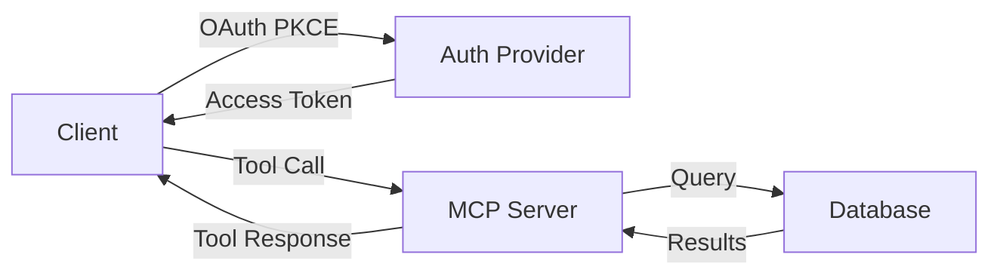

# Interactive Examples Guide
## MkDocs + Sphinx - What You Can Do

---

## 🎯 Interactive Features Available

### 1. Code Tabs (Multiple Languages)

**Markdown**:
```markdown
=== "Python"
    ```python
    import asyncio
    from atoms_mcp import AtomsMCP

    client = AtomsMCP()
    result = await client.call_tool(
        "entity_operation",
        {
            "operation": "create",
            "entity_type": "document",
            "properties": {"title": "My Doc"}
        }
    )
    ```

=== "Curl"
    ```bash
    curl -X POST https://api.atoms.io/tools/entity_operation \
      -H "Authorization: Bearer $TOKEN" \
      -H "Content-Type: application/json" \
      -d '{
        "operation": "create",
        "entity_type": "document",
        "properties": {"title": "My Doc"}
      }'
    ```

=== "JavaScript"
    ```javascript
    const client = new AtomsMCP();
    const result = await client.callTool(
        "entity_operation",
        {
            operation: "create",
            entity_type: "document",
            properties: { title: "My Doc" }
        }
    );
    ```
```

**Renders as**: Tabbed interface where users click to switch languages

---

### 2. Code Annotations (Explain Code)

**Markdown**:
```markdown
```python
result = await client.call_tool(  # (1)!
    "entity_operation",           # (2)!
    {                             # (3)!
        "operation": "create",    # (4)!
        "entity_type": "document" # (5)!
    }
)
```

1. Call the tool asynchronously
2. Tool name (one of 5 consolidated tools)
3. Parameters object
4. Operation type (create, read, update, delete)
5. Entity type (document, requirement, etc.)
```

**Renders as**: Code with numbered annotations on the right

---

### 3. Mermaid Diagrams (Interactive Flows)

**Markdown**:
```markdown

```

**Renders as**: Interactive diagram (can zoom, pan)

---

### 4. Collapsible Sections (Hide/Show)

**Markdown**:
```markdown
??? "Advanced Configuration"
    This section is hidden by default.
    Click to expand and see advanced options.

    ```python
    # Advanced configuration
    client = AtomsMCP(
        timeout=30,
        retry_count=3,
        cache_ttl=3600
    )
    ```

??? "Error Handling"
    Learn how to handle errors gracefully.

    ```python
    try:
        result = await client.call_tool(...)
    except ToolNotFoundError:
        print("Tool not found")
    except AuthenticationError:
        print("Authentication failed")
    ```
```

**Renders as**: Expandable sections (click to show/hide)

---

### 5. Admonitions (Warnings, Tips, Notes)

**Markdown**:
```markdown
!!! warning "Important"
    This is a critical warning that users should see.
    Make sure to read this before proceeding.

!!! tip "Pro Tip"
    Here's a helpful tip to make your life easier.
    This is optional but recommended.

!!! info "Note"
    This is informational content.
    It provides context but isn't critical.

!!! success "Success"
    Great! You've completed this step.

!!! danger "Danger"
    This action cannot be undone.
    Proceed with caution.
```

**Renders as**: Colored boxes with icons

---

### 6. Tabs (Organize Content)

**Markdown**:
```markdown
=== "Getting Started"
    Quick start guide for beginners.

    1. Install MCP
    2. Connect to Atoms
    3. Make first call

=== "Advanced"
    Advanced topics for experienced users.

    - Custom authentication
    - Performance tuning
    - Error handling

=== "Troubleshooting"
    Common issues and solutions.

    - Connection errors
    - Authentication failures
    - Timeout issues
```

**Renders as**: Tabbed interface

---

### 7. Tables (Structured Data)

**Markdown**:
```markdown
| Tool | Purpose | Parameters |
|------|---------|-----------|
| workspace_operation | Manage workspaces | context_type, entity_id |
| entity_operation | CRUD entities | operation, entity_type, properties |
| relationship_operation | Link entities | operation, source_id, target_id |
| workflow_execute | Run workflows | workflow_id, parameters |
| data_query | Search data | query, filters, limit |
```

**Renders as**: Formatted table

---

### 8. Code Highlighting (Syntax)

**Markdown**:
```markdown
```python
# This code is highlighted
def create_entity(entity_type: str, properties: dict) -> dict:
    """Create a new entity."""
    return {
        "id": "ent_123",
        "type": entity_type,
        "properties": properties
    }
```
```

**Renders as**: Syntax-highlighted code

---

### 9. Inline Code & Links

**Markdown**:
```markdown
Use the `entity_operation` tool to create entities.

See [Entity Operations Guide](../03-the-5-tools/21_entity_operation.md)
for more details.

Learn about [OAuth Flow](../04-integration-guides/33_oauth_pkce_flow.md).
```

**Renders as**: Inline code and clickable links

---

### 10. Lists & Nested Content

**Markdown**:
```markdown
## Installation Steps

1. Install MCP
   - Via pip: `pip install atoms-mcp`
   - Via npm: `npm install atoms-mcp`

2. Configure authentication
   - Set environment variables
   - Or use OAuth flow

3. Make first call
   - Choose a tool
   - Call it
   - Parse response
```

**Renders as**: Formatted lists with nesting

---

## 🎨 Example: Complete Interactive Document

```markdown
# Using the entity_operation Tool

## Overview

The `entity_operation` tool allows you to create, read, update, and delete
entities in your Atoms workspace.

## Quick Start

=== "Python"
    ```python
    result = await client.call_tool(
        "entity_operation",
        {"operation": "create", "entity_type": "document"}
    )
    ```

=== "Curl"
    ```bash
    curl -X POST https://api.atoms.io/tools/entity_operation \
      -d '{"operation": "create", "entity_type": "document"}'
    ```

## Operations

### Create

```python
result = await client.call_tool(  # (1)!
    "entity_operation",           # (2)!
    {
        "operation": "create",    # (3)!
        "entity_type": "document",
        "properties": {
            "title": "My Document",
            "content": "..."
        }
    }
)
```

1. Call the tool
2. Tool name
3. Operation type

!!! success "Success"
    Entity created with ID: `ent_123`

### Read

```python
result = await client.call_tool(
    "entity_operation",
    {"operation": "read", "entity_id": "ent_123"}
)
```

??? "Response Example"
    ```json
    {
        "id": "ent_123",
        "type": "document",
        "title": "My Document",
        "content": "...",
        "created_at": "2025-11-23T10:00:00Z"
    }
    ```

## Error Handling

!!! warning "Important"
    Always handle errors when calling tools.

```python
try:
    result = await client.call_tool(...)
except ToolNotFoundError:
    print("Tool not found")
except AuthenticationError:
    print("Authentication failed")
```

## See Also

- [Relationship Operations](22_relationship_operation.md)
- [Workflow Execution](23_workflow_execute.md)
- [Error Handling Guide](../05-advanced-topics/44_error_handling.md)
```

---

## 🎯 What This Enables

### For Users
- ✅ See examples in their preferred language
- ✅ Understand code with annotations
- ✅ Visualize flows with diagrams
- ✅ Hide/show advanced topics
- ✅ Get warnings and tips

### For Developers
- ✅ Write once, display multiple ways
- ✅ Keep examples DRY (Don't Repeat Yourself)
- ✅ Easy to maintain
- ✅ Professional appearance
- ✅ Engaging content

---

## 🚀 Implementation

All of this is built into MkDocs with:
- `pymdown-extensions` (tabs, annotations, admonitions)
- `mkdocs-mermaid2` (diagrams)
- Material theme (styling)

**No additional tools needed!**

---

## 📝 Example: MCP Tool Documentation

```markdown
# workspace_operation Tool

## Purpose

Manage workspace context and organization.

## Parameters

| Parameter | Type | Required | Description |
|-----------|------|----------|-------------|
| operation | string | Yes | create, read, update, delete, list |
| context_type | string | Yes | project, team, workspace |
| entity_id | string | No | Entity ID for context |

## Examples

=== "Set Project Context"
    ```python
    result = await client.call_tool(
        "workspace_operation",
        {
            "operation": "set_context",
            "context_type": "project",
            "entity_id": "proj_123"
        }
    )
    ```

=== "List Workspaces"
    ```python
    result = await client.call_tool(
        "workspace_operation",
        {"operation": "list"}
    )
    ```

## Response

```json
{
    "success": true,
    "data": {
        "active_project": "proj_123",
        "recent_projects": ["proj_123", "proj_456"]
    }
}
```

## Error Handling

!!! warning "Context Required"
    Some operations require an active context.
    Set context first using `set_context` operation.

??? "Common Errors"
    - `400 Bad Request` - Invalid parameters
    - `401 Unauthorized` - Auth token invalid
    - `403 Forbidden` - Permission denied
    - `404 Not Found` - Entity not found

## See Also

- [entity_operation](21_entity_operation.md)
- [Authentication Guide](../04-integration-guides/32_authentication_guide.md)
```

---

## ✨ Why This Matters

**Interactive examples make documentation**:
- ✅ More engaging
- ✅ Easier to understand
- ✅ Faster to learn from
- ✅ More professional
- ✅ Better for different learning styles

**All with zero additional cost or complexity!**


