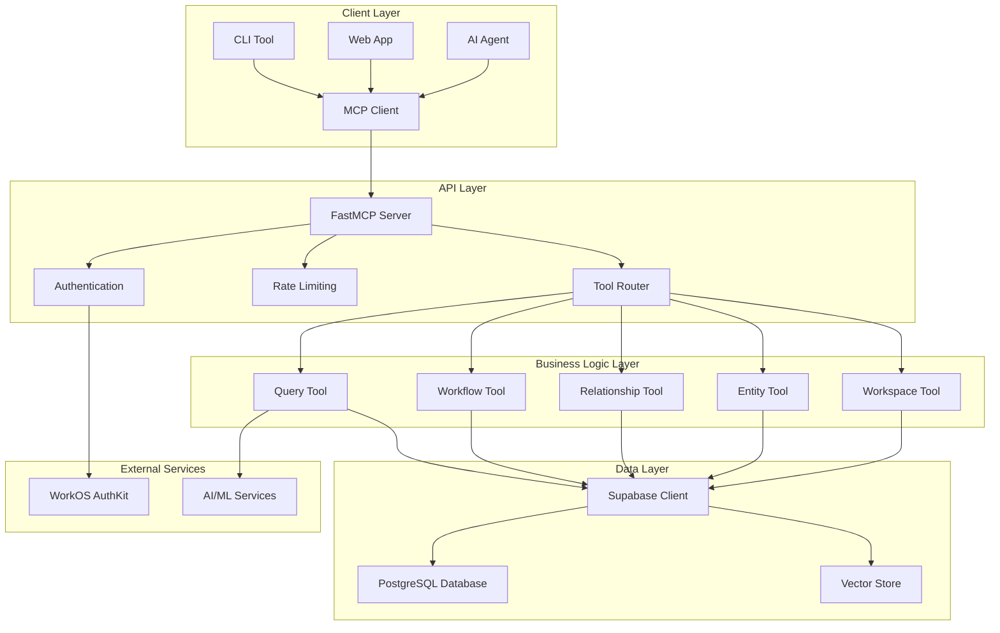
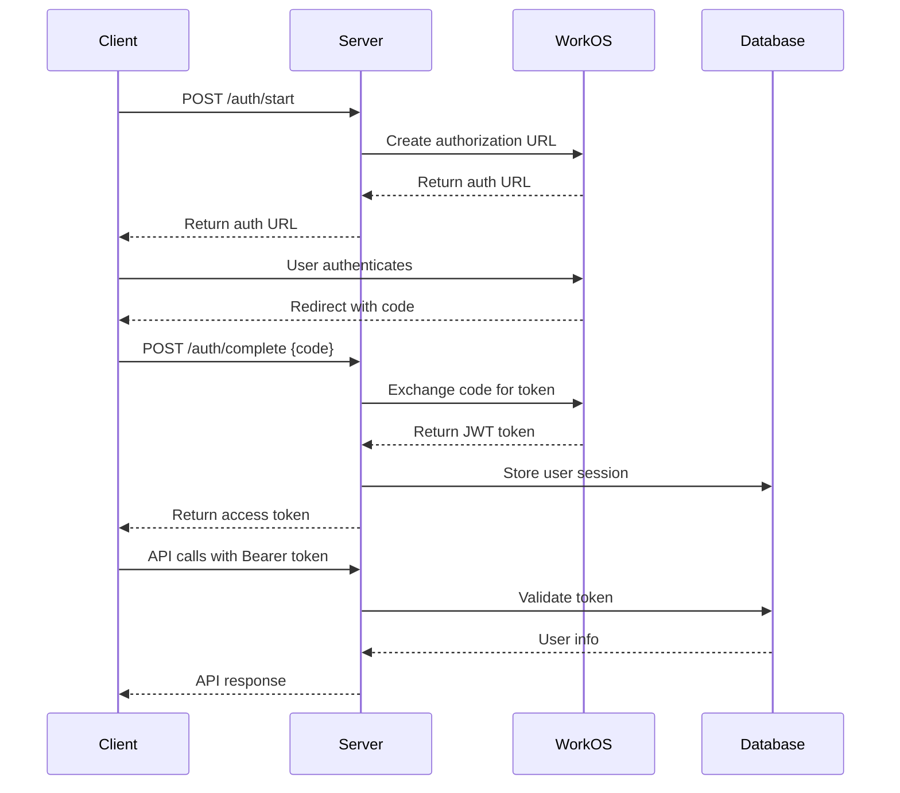
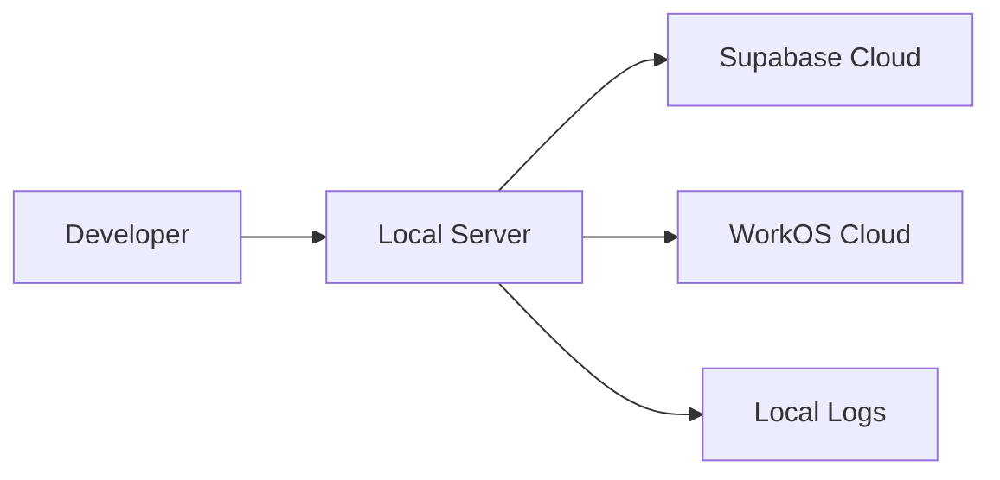
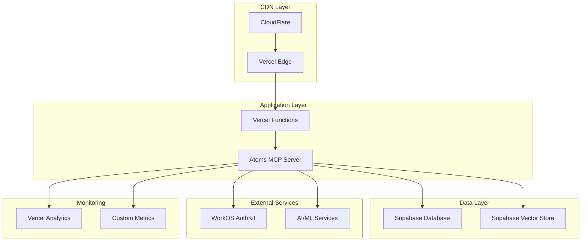

# Atoms MCP - Architecture Guide

## System Overview

Atoms MCP is a Model Context Protocol server designed for knowledge management, requirements tracking, and test management. It provides a unified interface for managing complex knowledge bases with AI-powered search capabilities.

## High-Level Architecture



## Core Components

### 1. FastMCP Server (`server/core.py`)

The central server component built on FastMCP framework:

```python
class AtomsServer:
    """Main MCP server implementation."""
    
    def __init__(self, config: ServerConfig):
        self.config = config
        self.mcp = FastMCP(
            name=config.name,
            instructions="Atoms MCP server...",
            auth=self._create_auth_provider()
        )
        self._register_tools()
    
    def _register_tools(self):
        """Register all available MCP tools."""
        self.mcp.tool()(workspace_operation)
        self.mcp.tool()(entity_operation)
        self.mcp.tool()(relationship_operation)
        self.mcp.tool()(workflow_execute)
        self.mcp.tool()(data_query)
```

**Key Features:**
- OAuth 2.0 authentication via WorkOS
- Rate limiting and request validation
- Tool registration and routing
- Error handling and logging

### 2. Tool Base Architecture (`tools/base.py`)

All tools inherit from a common base class:

```python
class ToolBase(ABC):
    """Base class for all MCP tools."""
    
    def __init__(self):
        self.logger = get_logger(self.__class__.__name__)
        self._db_client = None
        self._auth_provider = None
    
    @abstractmethod
    async def _validate_auth(self, auth_token: str) -> None:
        """Validate authentication token."""
        pass
    
    @abstractmethod
    async def _db_operation(self, operation: str, **kwargs) -> Any:
        """Perform database operation."""
        pass
    
    def _format_result(self, data: Any, format_type: str = "detailed") -> Dict[str, Any]:
        """Format result based on requested format."""
        # Common formatting logic
        pass
```

**Benefits:**
- Consistent error handling
- Shared authentication logic
- Common response formatting
- Centralized logging

### 3. Entity Management System (`tools/entity/`)

Comprehensive CRUD operations for all entity types:

```python
class EntityManager(ToolBase):
    """Manages CRUD operations for all entity types."""
    
    SUPPORTED_ENTITIES = {
        'organization': OrganizationSchema,
        'project': ProjectSchema,
        'requirement': RequirementSchema,
        'test': TestSchema,
        'document': DocumentSchema,
        'user': UserSchema
    }
    
    async def create_entity(self, entity_type: str, data: Dict[str, Any]) -> Dict[str, Any]:
        """Create a new entity with validation."""
        # Validate entity type
        if entity_type not in self.SUPPORTED_ENTITIES:
            raise ValueError(f"Unsupported entity type: {entity_type}")
        
        # Validate data against schema
        schema = self.SUPPORTED_ENTITIES[entity_type]
        validated_data = schema(**data)
        
        # Create in database
        result = await self._db_create(entity_type, validated_data.dict())
        
        return self._format_result(result)
```

**Features:**
- Type-safe entity schemas
- Automatic validation
- Batch operations
- Search capabilities
- Soft delete support

### 4. Query Engine (`tools/query.py`)

Advanced data querying with RAG capabilities:

```python
class DataQueryEngine(ToolBase):
    """Advanced data querying with RAG capabilities."""
    
    async def rag_search(
        self,
        entities: List[str],
        search_term: str,
        rag_mode: str = "auto",
        similarity_threshold: float = 0.7
    ) -> Dict[str, Any]:
        """Perform RAG-powered semantic search."""
        
        # Determine optimal search mode
        if rag_mode == "auto":
            rag_mode = self._determine_optimal_mode(search_term)
        
        # Build search query
        if rag_mode == "semantic":
            query = await self._build_semantic_query(entities, search_term)
        elif rag_mode == "keyword":
            query = await self._build_keyword_query(entities, search_term)
        else:  # hybrid
            query = await self._build_hybrid_query(entities, search_term)
        
        # Execute search
        results = await self._execute_search(query, similarity_threshold)
        
        return self._format_result(results)
```

**Capabilities:**
- Semantic search using vector embeddings
- Keyword-based full-text search
- Hybrid search combining both approaches
- Similarity scoring and ranking
- Multi-entity search across different types

### 5. Workflow Engine (`tools/workflow/`)

Complex multi-step workflow execution:

```python
class WorkflowExecutor(ToolBase):
    """Executes complex workflows with multiple steps."""
    
    WORKFLOWS = {
        'setup_project': self._setup_project_workflow,
        'import_requirements': self._import_requirements_workflow,
        'setup_test_matrix': self._setup_test_matrix_workflow,
        'bulk_status_update': self._bulk_status_update_workflow,
        'organization_onboarding': self._organization_onboarding_workflow
    }
    
    async def execute_workflow(
        self,
        workflow: str,
        parameters: Dict[str, Any],
        transaction_mode: bool = True
    ) -> Dict[str, Any]:
        """Execute a workflow with transaction support."""
        
        if workflow not in self.WORKFLOWS:
            raise ValueError(f"Unknown workflow: {workflow}")
        
        workflow_func = self.WORKFLOWS[workflow]
        
        if transaction_mode:
            return await self._execute_with_transaction(workflow_func, parameters)
        else:
            return await workflow_func(parameters)
```

**Features:**
- Transaction support for atomic operations
- Step-by-step execution tracking
- Error handling and rollback
- Progress reporting
- Configurable execution modes

## Data Architecture

### Database Schema

The system uses PostgreSQL with the following main entities:

```sql
-- Core entities
CREATE TABLE organizations (
    id UUID PRIMARY KEY DEFAULT gen_random_uuid(),
    name TEXT NOT NULL,
    type organization_type NOT NULL,
    created_at TIMESTAMP WITH TIME ZONE DEFAULT NOW(),
    updated_at TIMESTAMP WITH TIME ZONE DEFAULT NOW()
);

CREATE TABLE projects (
    id UUID PRIMARY KEY DEFAULT gen_random_uuid(),
    name TEXT NOT NULL,
    description TEXT,
    organization_id UUID REFERENCES organizations(id),
    status project_status DEFAULT 'active',
    created_at TIMESTAMP WITH TIME ZONE DEFAULT NOW()
);

CREATE TABLE requirements (
    id UUID PRIMARY KEY DEFAULT gen_random_uuid(),
    title TEXT NOT NULL,
    description TEXT,
    project_id UUID REFERENCES projects(id),
    priority requirement_priority DEFAULT 'medium',
    status requirement_status DEFAULT 'draft',
    format requirement_format DEFAULT 'EARS',
    created_at TIMESTAMP WITH TIME ZONE DEFAULT NOW()
);

CREATE TABLE tests (
    id UUID PRIMARY KEY DEFAULT gen_random_uuid(),
    name TEXT NOT NULL,
    description TEXT,
    project_id UUID REFERENCES projects(id),
    type test_type DEFAULT 'functional',
    status test_status DEFAULT 'draft',
    created_at TIMESTAMP WITH TIME ZONE DEFAULT NOW()
);

-- Relationships
CREATE TABLE entity_relationships (
    id UUID PRIMARY KEY DEFAULT gen_random_uuid(),
    relationship_type TEXT NOT NULL,
    source_entity_type TEXT NOT NULL,
    source_entity_id UUID NOT NULL,
    target_entity_type TEXT NOT NULL,
    target_entity_id UUID NOT NULL,
    metadata JSONB,
    created_at TIMESTAMP WITH TIME ZONE DEFAULT NOW()
);
```

### Vector Search Integration

For RAG capabilities, the system integrates with vector search:

```sql
-- Vector embeddings table
CREATE TABLE document_embeddings (
    id UUID PRIMARY KEY DEFAULT gen_random_uuid(),
    document_id UUID REFERENCES documents(id),
    content TEXT NOT NULL,
    embedding VECTOR(1536), -- OpenAI embedding dimension
    created_at TIMESTAMP WITH TIME ZONE DEFAULT NOW()
);

-- Vector similarity search function
CREATE OR REPLACE FUNCTION search_similar_content(
    query_embedding VECTOR(1536),
    similarity_threshold FLOAT DEFAULT 0.7,
    max_results INT DEFAULT 10
)
RETURNS TABLE (
    document_id UUID,
    content TEXT,
    similarity FLOAT
) AS $$
BEGIN
    RETURN QUERY
    SELECT 
        de.document_id,
        de.content,
        1 - (de.embedding <=> query_embedding) AS similarity
    FROM document_embeddings de
    WHERE 1 - (de.embedding <=> query_embedding) > similarity_threshold
    ORDER BY de.embedding <=> query_embedding
    LIMIT max_results;
END;
$$ LANGUAGE plpgsql;
```

## Authentication & Security

### OAuth 2.0 Flow



### Row-Level Security (RLS)

The system implements RLS policies to ensure data isolation:

```sql
-- Enable RLS on all tables
ALTER TABLE organizations ENABLE ROW LEVEL SECURITY;
ALTER TABLE projects ENABLE ROW LEVEL SECURITY;
ALTER TABLE requirements ENABLE ROW LEVEL SECURITY;

-- Example RLS policy for projects
CREATE POLICY "Users can only access projects in their organization"
ON projects
FOR ALL
TO authenticated
USING (
    organization_id IN (
        SELECT organization_id 
        FROM user_organizations 
        WHERE user_id = auth.uid()
    )
);
```

## Configuration Management

### Environment-Based Configuration

```python
@dataclass
class ServerConfig:
    """Server configuration."""
    name: str
    transport: str
    host: str
    port: int
    base_url: str
    auth_mode: str
    log_level: str
    
    @classmethod
    def from_env(cls) -> 'ServerConfig':
        """Load configuration from environment variables."""
        return cls(
            name=get_env_var('ATOMS_FASTMCP_NAME', 'atoms-mcp'),
            transport=get_env_var('ATOMS_FASTMCP_TRANSPORT', 'http'),
            host=get_env_var('ATOMS_FASTMCP_HOST', '127.0.0.1'),
            port=int(get_env_var('ATOMS_FASTMCP_PORT', '8000')),
            base_url=get_env_var('ATOMS_BASE_URL'),
            auth_mode=get_env_var('ATOMS_AUTH_MODE', 'required'),
            log_level=get_env_var('ATOMS_LOG_LEVEL', 'INFO')
        )
```

### YAML Configuration

The system also supports YAML configuration files:

```yaml
# config/atoms-mcp.yaml
server:
  name: "atoms-mcp"
  environment: "production"
  transport: "http"
  host: "127.0.0.1"
  port: 8000
  http_path: "/api/mcp"
  base_url: "https://mcp.atoms.tech"
  log_level: "INFO"

kinfra:
  enabled: true
  project_name: "atoms-mcp"
  port:
    preferred: 8100
    range: [8100, 8199]

fastmcp:
  rate_limit_rpm: 120
  max_concurrent_requests: 10
```

## Logging & Observability

### Structured Logging

```python
class StructuredLogger:
    """Structured logger with context."""
    
    def __init__(self, name: str):
        self.logger = logging.getLogger(name)
        self.logger.setLevel(logging.INFO)
        
        # JSON formatter for structured logs
        handler = logging.StreamHandler()
        formatter = logging.Formatter(
            '%(asctime)s - %(name)s - %(levelname)s - %(message)s'
        )
        handler.setFormatter(formatter)
        self.logger.addHandler(handler)
    
    def log_operation(
        self,
        operation: str,
        entity_type: str,
        duration_ms: float,
        success: bool,
        **kwargs
    ):
        """Log operation with structured data."""
        log_data = {
            "operation": operation,
            "entity_type": entity_type,
            "duration_ms": duration_ms,
            "success": success,
            "timestamp": datetime.now().isoformat(),
            **kwargs
        }
        self.logger.info(json.dumps(log_data))
```

### Metrics Collection

```python
class MetricsCollector:
    """Collect and track performance metrics."""
    
    def __init__(self):
        self.counters = defaultdict(int)
        self.timers = defaultdict(list)
        self.gauges = defaultdict(float)
    
    def increment_counter(self, name: str, value: int = 1):
        """Increment a counter metric."""
        self.counters[name] += value
    
    def record_timer(self, name: str, duration_ms: float):
        """Record a timer metric."""
        self.timers[name].append(duration_ms)
    
    def get_metrics(self) -> Dict[str, Any]:
        """Get all collected metrics."""
        return {
            "counters": dict(self.counters),
            "timers": {
                name: {
                    "count": len(times),
                    "avg_ms": sum(times) / len(times) if times else 0,
                    "min_ms": min(times) if times else 0,
                    "max_ms": max(times) if times else 0
                }
                for name, times in self.timers.items()
            },
            "gauges": dict(self.gauges)
        }
```

## Deployment Architecture

### Local Development



### Production Deployment



### Environment Configuration

| Environment | URL | Database | Auth | Purpose |
|-------------|-----|----------|------|---------|
| Local | `http://localhost:8000` | Supabase Cloud | WorkOS | Development |
| Development | `https://devmcp.atoms.tech` | Supabase Cloud | WorkOS | Testing |
| Production | `https://mcp.atoms.tech` | Supabase Cloud | WorkOS | Live |

## Performance Considerations

### Database Optimization

1. **Indexing Strategy:**
```sql
-- Primary indexes
CREATE INDEX idx_projects_organization_id ON projects(organization_id);
CREATE INDEX idx_requirements_project_id ON requirements(project_id);
CREATE INDEX idx_tests_project_id ON tests(project_id);

-- Search indexes
CREATE INDEX idx_requirements_search ON requirements USING gin(to_tsvector('english', title || ' ' || description));
CREATE INDEX idx_documents_search ON documents USING gin(to_tsvector('english', title || ' ' || content));

-- Vector indexes
CREATE INDEX idx_document_embeddings_vector ON document_embeddings USING ivfflat (embedding vector_cosine_ops);
```

2. **Connection Pooling:**
```python
class DatabasePool:
    """Database connection pool."""
    
    def __init__(self, url: str, min_connections: int = 5, max_connections: int = 20):
        self.pool = create_pool(
            url,
            min_size=min_connections,
            max_size=max_connections,
            command_timeout=60
        )
```

### Caching Strategy

1. **Query Result Caching:**
```python
from functools import lru_cache
import redis

class QueryCache:
    """Query result caching."""
    
    def __init__(self, redis_client: redis.Redis):
        self.redis = redis_client
        self.ttl = 300  # 5 minutes
    
    async def get_cached_result(self, query_key: str) -> Optional[Dict]:
        """Get cached query result."""
        cached = await self.redis.get(query_key)
        return json.loads(cached) if cached else None
    
    async def cache_result(self, query_key: str, result: Dict):
        """Cache query result."""
        await self.redis.setex(
            query_key,
            self.ttl,
            json.dumps(result)
        )
```

### Rate Limiting

```python
class RateLimiter:
    """API rate limiting."""
    
    def __init__(self, requests_per_minute: int = 120):
        self.requests_per_minute = requests_per_minute
        self.requests = defaultdict(list)
    
    async def check_rate_limit(self, identifier: str) -> bool:
        """Check if rate limit is exceeded."""
        now = datetime.now()
        minute_ago = now - timedelta(minutes=1)
        
        # Clean old requests
        self.requests[identifier] = [
            req_time for req_time in self.requests[identifier]
            if req_time > minute_ago
        ]
        
        # Check limit
        if len(self.requests[identifier]) >= self.requests_per_minute:
            return False
        
        self.requests[identifier].append(now)
        return True
```

## Security Architecture

### Data Protection

1. **Encryption at Rest:**
   - Database encryption via Supabase
   - Sensitive fields encrypted with application-level encryption

2. **Encryption in Transit:**
   - HTTPS/TLS for all API communications
   - Secure WebSocket connections for real-time features

3. **Access Control:**
   - OAuth 2.0 with WorkOS
   - Row-level security policies
   - API key management for service accounts

### Input Validation

```python
class InputValidator:
    """Comprehensive input validation."""
    
    def validate_entity_data(self, entity_type: str, data: Dict[str, Any]) -> Dict[str, Any]:
        """Validate entity data against schema."""
        schema = self.get_entity_schema(entity_type)
        
        try:
            validated_data = schema(**data)
            return validated_data.dict()
        except ValidationError as e:
            raise ValueError(f"Validation error: {e}")
    
    def sanitize_search_term(self, search_term: str) -> str:
        """Sanitize search terms to prevent injection."""
        # Remove potentially dangerous characters
        sanitized = re.sub(r'[<>"\';]', '', search_term)
        return sanitized.strip()
```

## Monitoring & Alerting

### Health Checks

```python
class HealthChecker:
    """System health monitoring."""
    
    async def check_database_health(self) -> Dict[str, Any]:
        """Check database connectivity and performance."""
        try:
            start_time = time.time()
            result = await self.db_client.query("SELECT 1")
            response_time = (time.time() - start_time) * 1000
            
            return {
                "status": "healthy",
                "response_time_ms": response_time,
                "timestamp": datetime.now().isoformat()
            }
        except Exception as e:
            return {
                "status": "unhealthy",
                "error": str(e),
                "timestamp": datetime.now().isoformat()
            }
    
    async def check_auth_health(self) -> Dict[str, Any]:
        """Check authentication service health."""
        try:
            # Test WorkOS connectivity
            await self.auth_provider.validate_token("test")
            return {"status": "healthy"}
        except Exception as e:
            return {"status": "unhealthy", "error": str(e)}
```

### Error Tracking

```python
class ErrorTracker:
    """Error tracking and reporting."""
    
    def track_error(
        self,
        error: Exception,
        context: Dict[str, Any],
        user_id: Optional[str] = None
    ):
        """Track error with context."""
        error_data = {
            "error_type": type(error).__name__,
            "error_message": str(error),
            "context": context,
            "user_id": user_id,
            "timestamp": datetime.now().isoformat(),
            "stack_trace": traceback.format_exc()
        }
        
        # Send to error tracking service
        self.send_to_tracking_service(error_data)
```

## Scalability Considerations

### Horizontal Scaling

1. **Stateless Design:**
   - No session storage in application
   - All state stored in database
   - Load balancer friendly

2. **Database Scaling:**
   - Read replicas for query operations
   - Connection pooling
   - Query optimization

3. **Caching Layer:**
   - Redis for query result caching
   - CDN for static content
   - Application-level caching

### Performance Monitoring

```python
class PerformanceMonitor:
    """Performance monitoring and alerting."""
    
    def __init__(self):
        self.metrics = MetricsCollector()
        self.alert_thresholds = {
            "response_time_ms": 1000,
            "error_rate": 0.05,
            "memory_usage": 0.8
        }
    
    async def monitor_operation(self, operation_name: str):
        """Monitor operation performance."""
        start_time = time.time()
        
        try:
            # Execute operation
            result = await self.execute_operation(operation_name)
            
            # Record success metrics
            duration_ms = (time.time() - start_time) * 1000
            self.metrics.record_timer(f"{operation_name}_duration", duration_ms)
            self.metrics.increment_counter(f"{operation_name}_success")
            
            return result
            
        except Exception as e:
            # Record error metrics
            self.metrics.increment_counter(f"{operation_name}_error")
            self.track_error(e, {"operation": operation_name})
            raise
```

This architecture provides a robust, scalable, and maintainable foundation for the Atoms MCP system, supporting both current requirements and future growth.