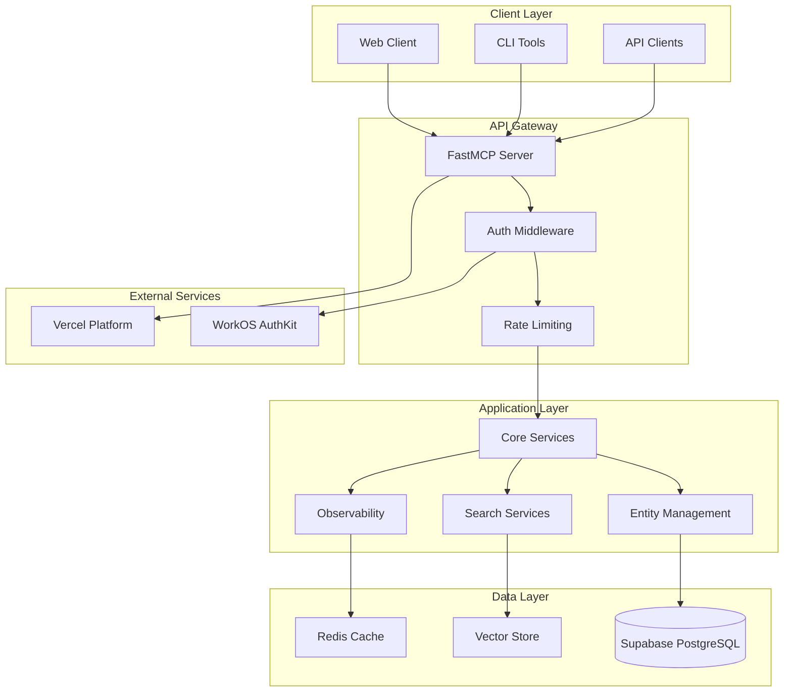
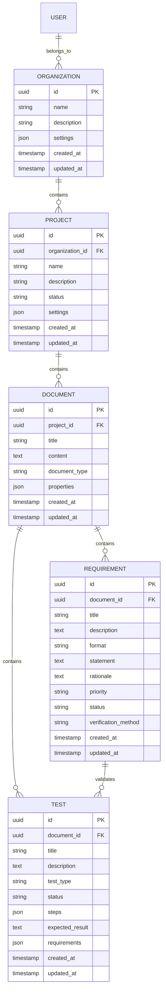

# Atoms MCP - Developer Guide

## Table of Contents
- [Architecture Overview](#architecture-overview)
- [Development Setup](#development-setup)
- [Code Organization](#code-organization)
- [API Development](#api-development)
- [Database Schema](#database-schema)
- [Authentication & Security](#authentication--security)
- [Testing](#testing)
- [Deployment](#deployment)
- [Contributing](#contributing)

## Architecture Overview

Atoms MCP follows a modern microservices architecture with clear separation of concerns and scalable design patterns.

### System Architecture



### Technology Stack

- **Backend**: Python 3.11+, FastAPI, FastMCP
- **Database**: PostgreSQL with Supabase
- **Vector Search**: pgvector extension
- **Authentication**: WorkOS AuthKit
- **Caching**: Redis
- **Deployment**: Vercel
- **Monitoring**: Custom observability stack

## Development Setup

### Prerequisites

```bash
# Required software
python >= 3.11
uv (Python package manager)
node >= 18 (for frontend tools)
docker (for local services)
```

### Local Development Environment

```bash
# 1. Clone repository
git clone https://github.com/your-org/atoms-mcp.git
cd atoms-mcp

# 2. Install dependencies
uv sync

# 3. Set up environment
cp .env.example .env
# Edit .env with your configuration

# 4. Start local services
docker-compose up -d  # PostgreSQL, Redis

# 5. Run database migrations
python scripts/migrate.py

# 6. Start development server
python server/entry_points/main.py --dev
```

### Environment Configuration

```bash
# .env file
# Database
SUPABASE_URL=http://localhost:54321
SUPABASE_SERVICE_ROLE_KEY=your-local-key
SUPABASE_ANON_KEY=your-anon-key

# Authentication
WORKOS_API_KEY=your-workos-key
WORKOS_CLIENT_ID=your-client-id
WORKOS_REDIRECT_URI=http://localhost:8000/auth/callback

# Application
ATOMS_TARGET_ENVIRONMENT=local
ATOMS_DEBUG=true
ATOMS_LOG_LEVEL=DEBUG

# Redis
REDIS_URL=redis://localhost:6379

# Vector Search
VECTOR_DIMENSION=1536
VECTOR_SIMILARITY_THRESHOLD=0.7
```

### IDE Configuration

#### VS Code Settings

```json
{
    "python.defaultInterpreterPath": "./.venv/bin/python",
    "python.linting.enabled": true,
    "python.linting.pylintEnabled": true,
    "python.formatting.provider": "black",
    "python.testing.pytestEnabled": true,
    "python.testing.pytestArgs": ["tests/"],
    "files.exclude": {
        "**/__pycache__": true,
        "**/*.pyc": true,
        ".pytest_cache": true
    }
}
```

#### PyCharm Configuration

1. Set Python interpreter to `.venv/bin/python`
2. Configure pytest as test runner
3. Enable code inspection and formatting
4. Set up database tools for Supabase

## Code Organization

### Directory Structure

```
atoms-mcp/
├── src/atoms_mcp/              # Main application code
│   ├── api/                    # API endpoints and handlers
│   ├── core/                   # Core application logic
│   │   └── mcp_server.py       # MCP server implementation
│   ├── models/                 # Data models and schemas
│   │   ├── base.py             # Base entity models
│   │   └── enums.py            # Enumeration definitions
│   └── services/               # Business logic services
├── lib/atoms/                  # Core library code
│   ├── core/                   # Core library functionality
│   ├── infrastructure/         # Infrastructure management
│   ├── observability/          # Monitoring and logging
│   ├── services/               # Library services
│   └── session/                # Session management
├── server/                     # Server implementation
│   ├── entry_points/           # Application entry points
│   ├── app.py                  # FastAPI application
│   ├── auth.py                 # Authentication logic
│   ├── core.py                 # Core server logic
│   └── tools.py                # Server tools
├── config/                     # Configuration files
│   ├── python/                 # Python configuration
│   └── yaml/                   # YAML configuration
├── tests/                      # Test code
│   ├── unit/                   # Unit tests
│   ├── integration/            # Integration tests
│   ├── comprehensive/          # Comprehensive tests
│   └── fixtures/               # Test fixtures
├── tools/                      # CLI tools and utilities
├── docs/                       # Documentation
└── schemas/                    # Schema definitions
```

### Code Patterns

#### 1. Entity Management Pattern

```python
# lib/atoms/core/entity_manager.py
from typing import Any, Dict, List, Optional
from uuid import UUID

class EntityManager:
    """Base class for entity management operations."""
    
    def __init__(self, entity_type: str, db_client):
        self.entity_type = entity_type
        self.db_client = db_client
    
    async def create(self, data: Dict[str, Any]) -> Dict[str, Any]:
        """Create a new entity."""
        # Validate data
        validated_data = self._validate_create_data(data)
        
        # Create entity
        entity = await self.db_client.create_entity(
            self.entity_type, 
            validated_data
        )
        
        # Log operation
        await self._log_operation("create", entity["id"])
        
        return entity
    
    async def read(self, entity_id: UUID) -> Optional[Dict[str, Any]]:
        """Read an entity by ID."""
        return await self.db_client.get_entity(
            self.entity_type, 
            entity_id
        )
    
    async def update(self, entity_id: UUID, data: Dict[str, Any]) -> Dict[str, Any]:
        """Update an entity."""
        # Validate data
        validated_data = self._validate_update_data(data)
        
        # Update entity
        entity = await self.db_client.update_entity(
            self.entity_type, 
            entity_id, 
            validated_data
        )
        
        # Log operation
        await self._log_operation("update", entity_id)
        
        return entity
    
    async def delete(self, entity_id: UUID) -> bool:
        """Delete an entity (soft delete)."""
        success = await self.db_client.soft_delete_entity(
            self.entity_type, 
            entity_id
        )
        
        if success:
            await self._log_operation("delete", entity_id)
        
        return success
    
    async def list(self, filters: Optional[Dict] = None, 
                   limit: int = 100, offset: int = 0) -> List[Dict[str, Any]]:
        """List entities with optional filtering."""
        return await self.db_client.list_entities(
            self.entity_type,
            filters=filters,
            limit=limit,
            offset=offset
        )
    
    def _validate_create_data(self, data: Dict[str, Any]) -> Dict[str, Any]:
        """Validate data for entity creation."""
        # Implementation specific to entity type
        pass
    
    def _validate_update_data(self, data: Dict[str, Any]) -> Dict[str, Any]:
        """Validate data for entity update."""
        # Implementation specific to entity type
        pass
    
    async def _log_operation(self, operation: str, entity_id: UUID):
        """Log entity operation."""
        # Log to observability system
        pass
```

#### 2. Service Layer Pattern

```python
# src/atoms_mcp/services/requirement_service.py
from typing import Any, Dict, List, Optional
from uuid import UUID

from lib.atoms.core.entity_manager import EntityManager
from lib.atoms.observability import get_logger

logger = get_logger(__name__)

class RequirementService:
    """Service for requirement management operations."""
    
    def __init__(self, db_client):
        self.entity_manager = EntityManager("requirement", db_client)
        self.db_client = db_client
    
    async def create_requirement(self, data: Dict[str, Any]) -> Dict[str, Any]:
        """Create a new requirement with validation."""
        # Validate requirement format
        if data.get("format") == "EARS":
            self._validate_ears_format(data)
        elif data.get("format") == "INCOSE":
            self._validate_incose_format(data)
        
        # Create requirement
        requirement = await self.entity_manager.create(data)
        
        # Create traceability links
        if "requirements" in data:
            await self._create_traceability_links(
                requirement["id"], 
                data["requirements"]
            )
        
        logger.info("Requirement created", 
                   requirement_id=requirement["id"],
                   format=data.get("format"))
        
        return requirement
    
    async def search_requirements(self, query: str, 
                                 filters: Optional[Dict] = None) -> List[Dict[str, Any]]:
        """Search requirements using semantic and text search."""
        # Semantic search
        semantic_results = await self._semantic_search(query, filters)
        
        # Text search
        text_results = await self._text_search(query, filters)
        
        # Combine and rank results
        combined_results = self._combine_search_results(
            semantic_results, 
            text_results
        )
        
        return combined_results
    
    def _validate_ears_format(self, data: Dict[str, Any]):
        """Validate EARS format requirements."""
        required_fields = ["statement", "rationale", "verification_method"]
        
        for field in required_fields:
            if field not in data:
                raise ValueError(f"EARS format requires {field}")
        
        # Validate statement format
        statement = data["statement"]
        if not any(word in statement.upper() for word in ["SHALL", "SHOULD", "MAY"]):
            raise ValueError("EARS statement must contain SHALL, SHOULD, or MAY")
    
    def _validate_incose_format(self, data: Dict[str, Any]):
        """Validate INCOSE format requirements."""
        required_fields = ["id", "text", "rationale", "verification"]
        
        for field in required_fields:
            if field not in data:
                raise ValueError(f"INCOSE format requires {field}")
    
    async def _create_traceability_links(self, requirement_id: UUID, 
                                       linked_requirements: List[str]):
        """Create traceability links between requirements."""
        for linked_req in linked_requirements:
            await self.db_client.create_relationship(
                "requirement_traceability",
                {
                    "source_requirement_id": requirement_id,
                    "target_requirement_id": linked_req,
                    "relationship_type": "traces_to"
                }
            )
    
    async def _semantic_search(self, query: str, 
                              filters: Optional[Dict]) -> List[Dict[str, Any]]:
        """Perform semantic search on requirements."""
        # Implementation for vector search
        pass
    
    async def _text_search(self, query: str, 
                          filters: Optional[Dict]) -> List[Dict[str, Any]]:
        """Perform full-text search on requirements."""
        # Implementation for text search
        pass
    
    def _combine_search_results(self, semantic_results: List[Dict], 
                               text_results: List[Dict]) -> List[Dict[str, Any]]:
        """Combine and rank search results."""
        # Implementation for result combination
        pass
```

#### 3. API Handler Pattern

```python
# src/atoms_mcp/api/entity_handler.py
from typing import Any, Dict, Optional
from uuid import UUID

from fastapi import APIRouter, HTTPException, Depends
from pydantic import BaseModel

from src.atoms_mcp.services.requirement_service import RequirementService
from server.auth import get_current_user

router = APIRouter(prefix="/api/entities", tags=["entities"])

class EntityCreateRequest(BaseModel):
    entity_type: str
    data: Dict[str, Any]

class EntityUpdateRequest(BaseModel):
    data: Dict[str, Any]

class EntityListResponse(BaseModel):
    entities: list[Dict[str, Any]]
    total: int
    limit: int
    offset: int

@router.post("/", response_model=Dict[str, Any])
async def create_entity(
    request: EntityCreateRequest,
    current_user: dict = Depends(get_current_user)
):
    """Create a new entity."""
    try:
        # Get appropriate service based on entity type
        service = get_service_for_entity_type(request.entity_type)
        
        # Create entity
        entity = await service.create(request.data)
        
        return {
            "success": True,
            "data": entity,
            "message": f"{request.entity_type} created successfully"
        }
    
    except ValueError as e:
        raise HTTPException(status_code=400, detail=str(e))
    except Exception as e:
        raise HTTPException(status_code=500, detail="Internal server error")

@router.get("/{entity_id}", response_model=Dict[str, Any])
async def get_entity(
    entity_id: UUID,
    current_user: dict = Depends(get_current_user)
):
    """Get an entity by ID."""
    try:
        # Get appropriate service
        service = get_service_for_entity_type("generic")
        
        # Get entity
        entity = await service.read(entity_id)
        
        if not entity:
            raise HTTPException(status_code=404, detail="Entity not found")
        
        return {
            "success": True,
            "data": entity
        }
    
    except HTTPException:
        raise
    except Exception as e:
        raise HTTPException(status_code=500, detail="Internal server error")

@router.put("/{entity_id}", response_model=Dict[str, Any])
async def update_entity(
    entity_id: UUID,
    request: EntityUpdateRequest,
    current_user: dict = Depends(get_current_user)
):
    """Update an entity."""
    try:
        # Get appropriate service
        service = get_service_for_entity_type("generic")
        
        # Update entity
        entity = await service.update(entity_id, request.data)
        
        return {
            "success": True,
            "data": entity,
            "message": "Entity updated successfully"
        }
    
    except ValueError as e:
        raise HTTPException(status_code=400, detail=str(e))
    except Exception as e:
        raise HTTPException(status_code=500, detail="Internal server error")

@router.delete("/{entity_id}")
async def delete_entity(
    entity_id: UUID,
    current_user: dict = Depends(get_current_user)
):
    """Delete an entity."""
    try:
        # Get appropriate service
        service = get_service_for_entity_type("generic")
        
        # Delete entity
        success = await service.delete(entity_id)
        
        if not success:
            raise HTTPException(status_code=404, detail="Entity not found")
        
        return {
            "success": True,
            "message": "Entity deleted successfully"
        }
    
    except HTTPException:
        raise
    except Exception as e:
        raise HTTPException(status_code=500, detail="Internal server error")

@router.get("/", response_model=EntityListResponse)
async def list_entities(
    entity_type: str,
    limit: int = 100,
    offset: int = 0,
    filters: Optional[Dict[str, Any]] = None,
    current_user: dict = Depends(get_current_user)
):
    """List entities with filtering and pagination."""
    try:
        # Get appropriate service
        service = get_service_for_entity_type(entity_type)
        
        # List entities
        entities = await service.list(filters=filters, limit=limit, offset=offset)
        
        return EntityListResponse(
            entities=entities,
            total=len(entities),
            limit=limit,
            offset=offset
        )
    
    except Exception as e:
        raise HTTPException(status_code=500, detail="Internal server error")

def get_service_for_entity_type(entity_type: str):
    """Get the appropriate service for the entity type."""
    service_map = {
        "requirement": RequirementService,
        "test": TestService,
        "document": DocumentService,
        "project": ProjectService,
        "organization": OrganizationService
    }
    
    service_class = service_map.get(entity_type, GenericEntityService)
    return service_class(db_client)
```

## API Development

### MCP Tool Registration

```python
# src/atoms_mcp/core/mcp_server.py
from fastmcp import FastMCP
from typing import Any, Dict

class AtomsServer:
    def __init__(self):
        self.mcp = FastMCP("atoms-mcp")
        self._register_tools()
    
    def _register_tools(self):
        """Register MCP tools for AI agent interaction."""
        
        @self.mcp.tool()
        async def entity_tool(
            entity_type: str,
            operation: str,
            data: Dict[str, Any] = None,
            entity_id: str = None,
            filters: Dict[str, Any] = None,
            limit: int = 100,
            offset: int = 0
        ) -> Dict[str, Any]:
            """
            Entity management tool for CRUD operations.
            
            Args:
                entity_type: Type of entity (organization, project, document, requirement, test)
                operation: Operation to perform (create, read, update, delete, list)
                data: Entity data for create/update operations
                entity_id: Entity ID for read/update/delete operations
                filters: Filters for list operations
                limit: Maximum number of results for list operations
                offset: Offset for pagination
            
            Returns:
                Dictionary containing operation results
            """
            try:
                service = get_service_for_entity_type(entity_type)
                
                if operation == "create":
                    result = await service.create(data)
                elif operation == "read":
                    result = await service.read(entity_id)
                elif operation == "update":
                    result = await service.update(entity_id, data)
                elif operation == "delete":
                    result = await service.delete(entity_id)
                elif operation == "list":
                    result = await service.list(filters, limit, offset)
                else:
                    raise ValueError(f"Unknown operation: {operation}")
                
                return {
                    "success": True,
                    "data": result,
                    "operation": operation,
                    "entity_type": entity_type
                }
            
            except Exception as e:
                return {
                    "success": False,
                    "error": str(e),
                    "operation": operation,
                    "entity_type": entity_type
                }
        
        @self.mcp.tool()
        async def search_tool(
            query: str,
            entity_types: list[str] = None,
            search_type: str = "semantic",
            limit: int = 10,
            threshold: float = 0.7
        ) -> Dict[str, Any]:
            """
            Search tool for finding entities using semantic or text search.
            
            Args:
                query: Search query string
                entity_types: Types of entities to search (optional)
                search_type: Type of search (semantic, text, hybrid)
                limit: Maximum number of results
                threshold: Similarity threshold for semantic search
            
            Returns:
                Dictionary containing search results
            """
            try:
                if search_type == "semantic":
                    results = await self._semantic_search(query, entity_types, limit, threshold)
                elif search_type == "text":
                    results = await self._text_search(query, entity_types, limit)
                elif search_type == "hybrid":
                    results = await self._hybrid_search(query, entity_types, limit, threshold)
                else:
                    raise ValueError(f"Unknown search type: {search_type}")
                
                return {
                    "success": True,
                    "data": {
                        "results": results,
                        "query": query,
                        "search_type": search_type,
                        "total": len(results)
                    }
                }
            
            except Exception as e:
                return {
                    "success": False,
                    "error": str(e),
                    "query": query,
                    "search_type": search_type
                }
```

### API Response Formatting

```python
# lib/atoms/core/response_formatter.py
from typing import Any, Dict, Optional
from datetime import datetime

class APIResponseFormatter:
    """Standardized API response formatting."""
    
    @staticmethod
    def success(data: Any = None, message: str = "Operation completed successfully") -> Dict[str, Any]:
        """Format successful API response."""
        return {
            "success": True,
            "data": data,
            "message": message,
            "timestamp": datetime.utcnow().isoformat()
        }
    
    @staticmethod
    def error(error_code: str, message: str, details: Optional[Dict] = None) -> Dict[str, Any]:
        """Format error API response."""
        return {
            "success": False,
            "error": {
                "code": error_code,
                "message": message,
                "details": details
            },
            "timestamp": datetime.utcnow().isoformat()
        }
    
    @staticmethod
    def paginated(data: list, total: int, limit: int, offset: int) -> Dict[str, Any]:
        """Format paginated API response."""
        return {
            "success": True,
            "data": {
                "items": data,
                "pagination": {
                    "total": total,
                    "limit": limit,
                    "offset": offset,
                    "has_next": offset + limit < total,
                    "has_prev": offset > 0
                }
            },
            "timestamp": datetime.utcnow().isoformat()
        }
```

## Database Schema

### Entity Relationships



### Database Migrations

```python
# scripts/migrations/001_initial_schema.py
from sqlalchemy import create_engine, text

def upgrade(connection):
    """Create initial database schema."""
    
    # Organizations table
    connection.execute(text("""
        CREATE TABLE organizations (
            id UUID PRIMARY KEY DEFAULT gen_random_uuid(),
            name VARCHAR(255) NOT NULL,
            description TEXT,
            settings JSONB DEFAULT '{}',
            created_at TIMESTAMP WITH TIME ZONE DEFAULT NOW(),
            updated_at TIMESTAMP WITH TIME ZONE DEFAULT NOW()
        );
    """))
    
    # Projects table
    connection.execute(text("""
        CREATE TABLE projects (
            id UUID PRIMARY KEY DEFAULT gen_random_uuid(),
            organization_id UUID NOT NULL REFERENCES organizations(id),
            name VARCHAR(255) NOT NULL,
            description TEXT,
            status VARCHAR(50) DEFAULT 'active',
            settings JSONB DEFAULT '{}',
            created_at TIMESTAMP WITH TIME ZONE DEFAULT NOW(),
            updated_at TIMESTAMP WITH TIME ZONE DEFAULT NOW()
        );
    """))
    
    # Documents table
    connection.execute(text("""
        CREATE TABLE documents (
            id UUID PRIMARY KEY DEFAULT gen_random_uuid(),
            project_id UUID NOT NULL REFERENCES projects(id),
            title VARCHAR(500) NOT NULL,
            content TEXT,
            document_type VARCHAR(100),
            properties JSONB DEFAULT '{}',
            created_at TIMESTAMP WITH TIME ZONE DEFAULT NOW(),
            updated_at TIMESTAMP WITH TIME ZONE DEFAULT NOW()
        );
    """))
    
    # Requirements table
    connection.execute(text("""
        CREATE TABLE requirements (
            id UUID PRIMARY KEY DEFAULT gen_random_uuid(),
            document_id UUID NOT NULL REFERENCES documents(id),
            title VARCHAR(500) NOT NULL,
            description TEXT,
            format VARCHAR(50),
            statement TEXT,
            rationale TEXT,
            priority VARCHAR(50),
            status VARCHAR(50) DEFAULT 'draft',
            verification_method VARCHAR(100),
            created_at TIMESTAMP WITH TIME ZONE DEFAULT NOW(),
            updated_at TIMESTAMP WITH TIME ZONE DEFAULT NOW()
        );
    """))
    
    # Tests table
    connection.execute(text("""
        CREATE TABLE tests (
            id UUID PRIMARY KEY DEFAULT gen_random_uuid(),
            document_id UUID NOT NULL REFERENCES documents(id),
            title VARCHAR(500) NOT NULL,
            description TEXT,
            test_type VARCHAR(100),
            status VARCHAR(50) DEFAULT 'draft',
            steps JSONB DEFAULT '[]',
            expected_result TEXT,
            requirements JSONB DEFAULT '[]',
            created_at TIMESTAMP WITH TIME ZONE DEFAULT NOW(),
            updated_at TIMESTAMP WITH TIME ZONE DEFAULT NOW()
        );
    """))
    
    # Create indexes
    connection.execute(text("""
        CREATE INDEX idx_projects_organization_id ON projects(organization_id);
        CREATE INDEX idx_documents_project_id ON documents(project_id);
        CREATE INDEX idx_requirements_document_id ON requirements(document_id);
        CREATE INDEX idx_tests_document_id ON tests(document_id);
    """))
    
    # Enable Row Level Security
    connection.execute(text("""
        ALTER TABLE organizations ENABLE ROW LEVEL SECURITY;
        ALTER TABLE projects ENABLE ROW LEVEL SECURITY;
        ALTER TABLE documents ENABLE ROW LEVEL SECURITY;
        ALTER TABLE requirements ENABLE ROW LEVEL SECURITY;
        ALTER TABLE tests ENABLE ROW LEVEL SECURITY;
    """))

def downgrade(connection):
    """Drop initial database schema."""
    connection.execute(text("DROP TABLE IF EXISTS tests CASCADE;"))
    connection.execute(text("DROP TABLE IF EXISTS requirements CASCADE;"))
    connection.execute(text("DROP TABLE IF EXISTS documents CASCADE;"))
    connection.execute(text("DROP TABLE IF EXISTS projects CASCADE;"))
    connection.execute(text("DROP TABLE IF EXISTS organizations CASCADE;"))
```

## Authentication & Security

### JWT Token Management

```python
# server/auth.py
import jwt
from datetime import datetime, timedelta
from typing import Optional, Dict, Any
from fastapi import HTTPException, Depends
from fastapi.security import HTTPBearer, HTTPAuthorizationCredentials

security = HTTPBearer()

class AuthManager:
    """Authentication and authorization management."""
    
    def __init__(self, secret_key: str, algorithm: str = "HS256"):
        self.secret_key = secret_key
        self.algorithm = algorithm
    
    def create_token(self, user_data: Dict[str, Any], 
                    expires_delta: Optional[timedelta] = None) -> str:
        """Create JWT token for user."""
        to_encode = user_data.copy()
        
        if expires_delta:
            expire = datetime.utcnow() + expires_delta
        else:
            expire = datetime.utcnow() + timedelta(hours=24)
        
        to_encode.update({"exp": expire})
        
        return jwt.encode(to_encode, self.secret_key, algorithm=self.algorithm)
    
    def verify_token(self, token: str) -> Dict[str, Any]:
        """Verify and decode JWT token."""
        try:
            payload = jwt.decode(token, self.secret_key, algorithms=[self.algorithm])
            return payload
        except jwt.ExpiredSignatureError:
            raise HTTPException(status_code=401, detail="Token has expired")
        except jwt.JWTError:
            raise HTTPException(status_code=401, detail="Invalid token")
    
    async def get_current_user(self, 
                              credentials: HTTPAuthorizationCredentials = Depends(security)) -> Dict[str, Any]:
        """Get current user from JWT token."""
        token = credentials.credentials
        payload = self.verify_token(token)
        
        user_id = payload.get("sub")
        if user_id is None:
            raise HTTPException(status_code=401, detail="Invalid token payload")
        
        # Get user from database
        user = await self.get_user_by_id(user_id)
        if user is None:
            raise HTTPException(status_code=401, detail="User not found")
        
        return user
    
    async def get_user_by_id(self, user_id: str) -> Optional[Dict[str, Any]]:
        """Get user by ID from database."""
        # Implementation to fetch user from database
        pass
```

### Row Level Security (RLS)

```sql
-- RLS policies for organizations
CREATE POLICY "Users can view their organization" ON organizations
    FOR SELECT USING (
        id IN (
            SELECT organization_id 
            FROM user_organizations 
            WHERE user_id = auth.uid()
        )
    );

CREATE POLICY "Users can update their organization" ON organizations
    FOR UPDATE USING (
        id IN (
            SELECT organization_id 
            FROM user_organizations 
            WHERE user_id = auth.uid() AND role = 'admin'
        )
    );

-- RLS policies for projects
CREATE POLICY "Users can view projects in their organization" ON projects
    FOR SELECT USING (
        organization_id IN (
            SELECT organization_id 
            FROM user_organizations 
            WHERE user_id = auth.uid()
        )
    );

-- RLS policies for documents
CREATE POLICY "Users can view documents in their projects" ON documents
    FOR SELECT USING (
        project_id IN (
            SELECT p.id 
            FROM projects p
            JOIN user_organizations uo ON p.organization_id = uo.organization_id
            WHERE uo.user_id = auth.uid()
        )
    );
```

## Testing

### Unit Testing

```python
# tests/unit/test_requirement_service.py
import pytest
from unittest.mock import AsyncMock, MagicMock
from uuid import uuid4

from src.atoms_mcp.services.requirement_service import RequirementService

@pytest.fixture
def mock_db_client():
    """Mock database client."""
    client = AsyncMock()
    client.create_entity = AsyncMock()
    client.get_entity = AsyncMock()
    client.update_entity = AsyncMock()
    client.delete_entity = AsyncMock()
    client.list_entities = AsyncMock()
    return client

@pytest.fixture
def requirement_service(mock_db_client):
    """Requirement service with mocked dependencies."""
    return RequirementService(mock_db_client)

@pytest.mark.asyncio
async def test_create_requirement_success(requirement_service, mock_db_client):
    """Test successful requirement creation."""
    # Arrange
    requirement_data = {
        "title": "User Login",
        "description": "Users must be able to log in",
        "format": "EARS",
        "statement": "The system SHALL allow users to log in",
        "rationale": "Users need access to the system",
        "verification_method": "test"
    }
    
    expected_entity = {
        "id": uuid4(),
        "title": "User Login",
        "description": "Users must be able to log in",
        "format": "EARS",
        "statement": "The system SHALL allow users to log in",
        "rationale": "Users need access to the system",
        "verification_method": "test",
        "created_at": "2024-01-15T10:30:00Z"
    }
    
    mock_db_client.create_entity.return_value = expected_entity
    
    # Act
    result = await requirement_service.create_requirement(requirement_data)
    
    # Assert
    assert result == expected_entity
    mock_db_client.create_entity.assert_called_once_with("requirement", requirement_data)

@pytest.mark.asyncio
async def test_create_requirement_invalid_ears_format(requirement_service):
    """Test requirement creation with invalid EARS format."""
    # Arrange
    invalid_data = {
        "title": "Invalid Requirement",
        "format": "EARS",
        "statement": "This is not a valid EARS statement"  # Missing SHALL/SHOULD/MAY
    }
    
    # Act & Assert
    with pytest.raises(ValueError, match="EARS statement must contain SHALL, SHOULD, or MAY"):
        await requirement_service.create_requirement(invalid_data)

@pytest.mark.asyncio
async def test_search_requirements(requirement_service, mock_db_client):
    """Test requirement search functionality."""
    # Arrange
    query = "user authentication"
    expected_results = [
        {
            "id": uuid4(),
            "title": "User Authentication",
            "content": "Users must authenticate to access the system",
            "score": 0.95
        }
    ]
    
    mock_db_client.semantic_search.return_value = expected_results
    
    # Act
    results = await requirement_service.search_requirements(query)
    
    # Assert
    assert len(results) == 1
    assert results[0]["title"] == "User Authentication"
    mock_db_client.semantic_search.assert_called_once_with(
        "requirement", query, limit=10, threshold=0.7
    )
```

### Integration Testing

```python
# tests/integration/test_api_endpoints.py
import pytest
from fastapi.testclient import TestClient
from unittest.mock import patch

from server.app import app

client = TestClient(app)

@pytest.fixture
def auth_headers():
    """Mock authentication headers."""
    return {"Authorization": "Bearer mock-jwt-token"}

@pytest.mark.asyncio
async def test_create_organization(auth_headers):
    """Test organization creation endpoint."""
    with patch('server.auth.get_current_user') as mock_auth:
        mock_auth.return_value = {"id": "user-123", "email": "test@example.com"}
        
        response = client.post(
            "/api/entities",
            json={
                "entity_type": "organization",
                "data": {
                    "name": "Test Organization",
                    "description": "Test organization description"
                }
            },
            headers=auth_headers
        )
        
        assert response.status_code == 200
        data = response.json()
        assert data["success"] is True
        assert data["data"]["name"] == "Test Organization"

@pytest.mark.asyncio
async def test_get_entity_not_found(auth_headers):
    """Test getting non-existent entity."""
    with patch('server.auth.get_current_user') as mock_auth:
        mock_auth.return_value = {"id": "user-123", "email": "test@example.com"}
        
        response = client.get(
            "/api/entities/non-existent-id",
            headers=auth_headers
        )
        
        assert response.status_code == 404
        data = response.json()
        assert data["success"] is False
        assert "not found" in data["error"]["message"].lower()
```

### Performance Testing

```python
# tests/performance/test_load.py
import asyncio
import time
from concurrent.futures import ThreadPoolExecutor

import pytest
import requests

class TestLoadPerformance:
    """Load testing for API endpoints."""
    
    @pytest.mark.performance
    def test_concurrent_entity_creation(self):
        """Test concurrent entity creation performance."""
        base_url = "http://localhost:8000"
        headers = {"Authorization": "Bearer mock-token"}
        
        def create_entity(i):
            """Create a single entity."""
            data = {
                "entity_type": "organization",
                "data": {
                    "name": f"Test Organization {i}",
                    "description": f"Test organization {i} description"
                }
            }
            
            start_time = time.time()
            response = requests.post(f"{base_url}/api/entities", json=data, headers=headers)
            end_time = time.time()
            
            return {
                "status_code": response.status_code,
                "response_time": end_time - start_time,
                "entity_id": i
            }
        
        # Test with 100 concurrent requests
        with ThreadPoolExecutor(max_workers=10) as executor:
            futures = [executor.submit(create_entity, i) for i in range(100)]
            results = [future.result() for future in futures]
        
        # Analyze results
        successful_requests = [r for r in results if r["status_code"] == 200]
        response_times = [r["response_time"] for r in successful_requests]
        
        assert len(successful_requests) >= 95  # At least 95% success rate
        assert max(response_times) < 2.0  # No request takes more than 2 seconds
        assert sum(response_times) / len(response_times) < 0.5  # Average under 500ms
```

## Deployment

### Docker Configuration

```dockerfile
# Dockerfile
FROM python:3.11-slim

# Set working directory
WORKDIR /app

# Install system dependencies
RUN apt-get update && apt-get install -y \
    gcc \
    g++ \
    && rm -rf /var/lib/apt/lists/*

# Install Python dependencies
COPY pyproject.toml uv.lock ./
RUN pip install uv && uv sync --frozen

# Copy application code
COPY . .

# Set environment variables
ENV PYTHONPATH=/app
ENV PYTHONUNBUFFERED=1

# Expose port
EXPOSE 8000

# Health check
HEALTHCHECK --interval=30s --timeout=30s --start-period=5s --retries=3 \
    CMD curl -f http://localhost:8000/health || exit 1

# Run application
CMD ["python", "server/entry_points/main.py"]
```

### Docker Compose

```yaml
# docker-compose.yml
version: '3.8'

services:
  app:
    build: .
    ports:
      - "8000:8000"
    environment:
      - SUPABASE_URL=${SUPABASE_URL}
      - SUPABASE_SERVICE_ROLE_KEY=${SUPABASE_SERVICE_ROLE_KEY}
      - WORKOS_API_KEY=${WORKOS_API_KEY}
      - REDIS_URL=redis://redis:6379
    depends_on:
      - redis
    volumes:
      - ./logs:/app/logs

  redis:
    image: redis:7-alpine
    ports:
      - "6379:6379"
    volumes:
      - redis_data:/data

  postgres:
    image: postgres:15-alpine
    environment:
      - POSTGRES_DB=atoms_mcp
      - POSTGRES_USER=postgres
      - POSTGRES_PASSWORD=password
    ports:
      - "5432:5432"
    volumes:
      - postgres_data:/var/lib/postgresql/data

volumes:
  redis_data:
  postgres_data:
```

### Vercel Deployment

```json
{
  "version": 2,
  "builds": [
    {
      "src": "server/app.py",
      "use": "@vercel/python"
    }
  ],
  "routes": [
    {
      "src": "/(.*)",
      "dest": "server/app.py"
    }
  ],
  "env": {
    "PYTHONPATH": "/var/task"
  }
}
```

## Contributing

### Development Workflow

1. **Fork the repository**
2. **Create a feature branch**: `git checkout -b feature/your-feature-name`
3. **Make your changes** with proper tests
4. **Run tests**: `pytest tests/ -v`
5. **Run linting**: `ruff check .`
6. **Run formatting**: `black .`
7. **Commit changes**: `git commit -m "Add your feature"`
8. **Push to branch**: `git push origin feature/your-feature-name`
9. **Create pull request**

### Code Standards

- **Python**: Follow PEP 8, use type hints
- **Testing**: Maintain >90% code coverage
- **Documentation**: Update docs for all new features
- **Commits**: Use conventional commit messages

### Pull Request Process

1. **Description**: Clear description of changes
2. **Tests**: All tests must pass
3. **Documentation**: Update relevant documentation
4. **Review**: At least one code review required
5. **CI/CD**: All checks must pass

### Issue Reporting

- **Bug reports**: Use the bug report template
- **Feature requests**: Use the feature request template
- **Security issues**: Email security@atoms.tech

This developer guide provides comprehensive information for contributing to the Atoms MCP project. For additional help, contact the development team or check the project's GitHub repository.