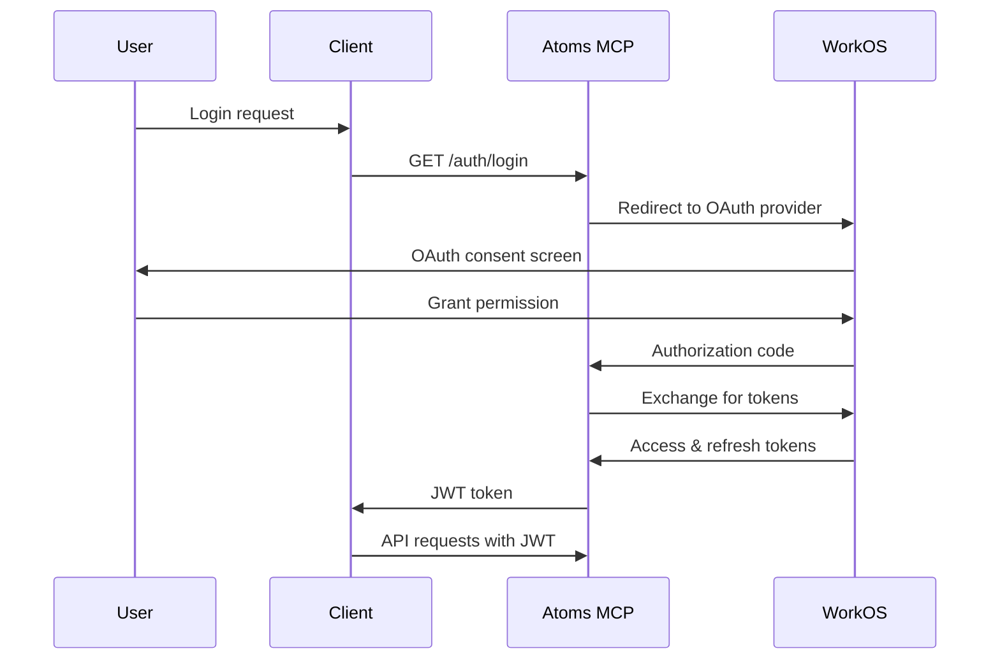

# Atoms MCP - User Guide

## Table of Contents
- [Overview](#overview)
- [Quick Start](#quick-start)
- [Authentication](#authentication)
- [Core Concepts](#core-concepts)
- [API Reference](#api-reference)
- [Usage Examples](#usage-examples)
- [Troubleshooting](#troubleshooting)

## Overview

Atoms MCP is a comprehensive knowledge management system designed for multi-tenant organizations. It provides powerful tools for requirements tracking, test management, document organization, and AI-powered search capabilities.

### Key Features
- 🏢 **Multi-tenant Organization Management** - Isolated workspaces for different organizations
- 📋 **Requirements Tracking** - Support for INCOSE/EARS requirement formats
- 🧪 **Test Management** - Comprehensive test case management with traceability
- 📄 **Document Management** - Rich document blocks with properties and metadata
- 🔍 **AI-Powered Search** - Vector semantic search and full-text search
- 🔐 **Secure Authentication** - OAuth 2.0 with WorkOS AuthKit
- 🔒 **Row-Level Security** - Database-level access control
- ⚡ **Real-time Updates** - Live data synchronization

## Quick Start

### Prerequisites
- Python 3.11 or higher
- Supabase account and project
- WorkOS account (for authentication)

### Installation

```bash
# Clone the repository
git clone https://github.com/your-org/atoms-mcp.git
cd atoms-mcp

# Install dependencies
uv sync

# Set up environment variables
cp .env.example .env
# Edit .env with your configuration
```

### Environment Configuration

```bash
# Required environment variables
export SUPABASE_URL="https://your-project.supabase.co"
export SUPABASE_SERVICE_ROLE_KEY="your-service-role-key"
export WORKOS_API_KEY="your-workos-api-key"
export WORKOS_CLIENT_ID="your-workos-client-id"

# Optional configuration
export ATOMS_TARGET_ENVIRONMENT="prod"  # local, dev, preview, prod
export ATOMS_SETTINGS_FILE="$(pwd)/config/yaml/atoms-mcp.yaml"
```

### Start the Server

```bash
# Start local development server
python server/entry_points/main.py

# Or use the convenience script
./atoms start
```

### Verify Installation

```bash
# Check server health
curl http://localhost:8000/health

# Expected response:
{
  "status": "healthy",
  "timestamp": "2024-01-15T10:30:00Z",
  "version": "1.0.0"
}
```

## Authentication

Atoms MCP uses WorkOS AuthKit for secure authentication. The system supports multiple OAuth providers and provides seamless user management.

### Supported Providers
- Google
- Microsoft
- GitHub
- Custom OAuth providers

### Authentication Flow



### Getting Started with Authentication

```python
# Example: Authenticate user
import requests

# Step 1: Get authorization URL
response = requests.get("https://mcp.atoms.tech/auth/login")
auth_url = response.json()["auth_url"]

# Step 2: Redirect user to auth_url
# User completes OAuth flow

# Step 3: Exchange code for token
token_response = requests.post("https://mcp.atoms.tech/auth/token", {
    "code": "authorization_code_from_callback"
})
access_token = token_response.json()["access_token"]

# Step 4: Use token for API requests
headers = {"Authorization": f"Bearer {access_token}"}
response = requests.get("https://mcp.atoms.tech/api/organizations", headers=headers)
```

## Core Concepts

### Organizations
Organizations are the top-level containers that provide multi-tenant isolation. Each organization has its own workspace with projects, documents, and users.

```python
# Organization structure
{
    "id": "uuid",
    "name": "Acme Corporation",
    "description": "Software development company",
    "settings": {
        "theme": "dark",
        "timezone": "UTC"
    },
    "created_at": "2024-01-15T10:30:00Z",
    "updated_at": "2024-01-15T10:30:00Z"
}
```

### Projects
Projects are containers within organizations that group related work items like requirements, tests, and documents.

```python
# Project structure
{
    "id": "uuid",
    "organization_id": "uuid",
    "name": "Mobile App Development",
    "description": "iOS and Android mobile application",
    "status": "active",
    "settings": {
        "requirement_format": "EARS",
        "test_framework": "pytest"
    },
    "created_at": "2024-01-15T10:30:00Z",
    "updated_at": "2024-01-15T10:30:00Z"
}
```

### Documents
Documents are the primary content containers that can contain requirements, tests, and other structured data.

```python
# Document structure
{
    "id": "uuid",
    "project_id": "uuid",
    "title": "User Authentication Requirements",
    "content": "The system shall authenticate users...",
    "document_type": "requirement",
    "properties": {
        "priority": "high",
        "category": "security",
        "tags": ["auth", "security", "user-management"]
    },
    "created_at": "2024-01-15T10:30:00Z",
    "updated_at": "2024-01-15T10:30:00Z"
}
```

### Requirements
Requirements follow industry standards like INCOSE and EARS formats for clear, testable specifications.

```python
# Requirement structure (EARS format)
{
    "id": "uuid",
    "document_id": "uuid",
    "title": "User Login",
    "description": "The system shall allow users to log in",
    "format": "EARS",
    "statement": "The system SHALL allow users to log in using their email and password",
    "rationale": "Users need secure access to the system",
    "priority": "high",
    "status": "approved",
    "verification_method": "test",
    "created_at": "2024-01-15T10:30:00Z",
    "updated_at": "2024-01-15T10:30:00Z"
}
```

### Tests
Tests provide traceability and validation for requirements and other work items.

```python
# Test structure
{
    "id": "uuid",
    "document_id": "uuid",
    "title": "User Login Test",
    "description": "Verify user can log in successfully",
    "test_type": "functional",
    "status": "draft",
    "steps": [
        "Navigate to login page",
        "Enter valid credentials",
        "Click login button",
        "Verify successful login"
    ],
    "expected_result": "User is logged in and redirected to dashboard",
    "requirements": ["req-001", "req-002"],
    "created_at": "2024-01-15T10:30:00Z",
    "updated_at": "2024-01-15T10:30:00Z"
}
```

## API Reference

### Base URL
- **Production**: `https://mcp.atoms.tech`
- **Development**: `https://devmcp.atoms.tech`
- **Local**: `http://localhost:8000`

### Authentication
All API requests require authentication via JWT token in the Authorization header:

```http
Authorization: Bearer <your-jwt-token>
```

### Common Response Format

```json
{
    "success": true,
    "data": { ... },
    "message": "Operation completed successfully",
    "timestamp": "2024-01-15T10:30:00Z"
}
```

### Error Response Format

```json
{
    "success": false,
    "error": {
        "code": "VALIDATION_ERROR",
        "message": "Invalid input data",
        "details": {
            "field": "email",
            "issue": "Invalid email format"
        }
    },
    "timestamp": "2024-01-15T10:30:00Z"
}
```

### Entity Management API

#### Create Entity
```http
POST /api/entities
Content-Type: application/json

{
    "entity_type": "organization",
    "data": {
        "name": "Acme Corporation",
        "description": "Software development company"
    }
}
```

**Response:**
```json
{
    "success": true,
    "data": {
        "id": "123e4567-e89b-12d3-a456-426614174000",
        "name": "Acme Corporation",
        "description": "Software development company",
        "created_at": "2024-01-15T10:30:00Z",
        "updated_at": "2024-01-15T10:30:00Z"
    }
}
```

#### Read Entity
```http
GET /api/entities/{entity_id}
```

**Response:**
```json
{
    "success": true,
    "data": {
        "id": "123e4567-e89b-12d3-a456-426614174000",
        "name": "Acme Corporation",
        "description": "Software development company",
        "created_at": "2024-01-15T10:30:00Z",
        "updated_at": "2024-01-15T10:30:00Z"
    }
}
```

#### Update Entity
```http
PUT /api/entities/{entity_id}
Content-Type: application/json

{
    "name": "Acme Corporation Inc.",
    "description": "Leading software development company"
}
```

**Response:**
```json
{
    "success": true,
    "data": {
        "id": "123e4567-e89b-12d3-a456-426614174000",
        "name": "Acme Corporation Inc.",
        "description": "Leading software development company",
        "created_at": "2024-01-15T10:30:00Z",
        "updated_at": "2024-01-15T10:35:00Z"
    }
}
```

#### Delete Entity
```http
DELETE /api/entities/{entity_id}
```

**Response:**
```json
{
    "success": true,
    "message": "Entity deleted successfully"
}
```

#### List Entities
```http
GET /api/entities?entity_type=organization&limit=10&offset=0
```

**Response:**
```json
{
    "success": true,
    "data": {
        "entities": [
            {
                "id": "123e4567-e89b-12d3-a456-426614174000",
                "name": "Acme Corporation",
                "description": "Software development company",
                "created_at": "2024-01-15T10:30:00Z",
                "updated_at": "2024-01-15T10:30:00Z"
            }
        ],
        "total": 1,
        "limit": 10,
        "offset": 0
    }
}
```

### Search API

#### Semantic Search
```http
POST /api/search/semantic
Content-Type: application/json

{
    "query": "user authentication requirements",
    "entity_types": ["requirement", "document"],
    "limit": 10,
    "threshold": 0.7
}
```

**Response:**
```json
{
    "success": true,
    "data": {
        "results": [
            {
                "id": "req-001",
                "title": "User Authentication Requirements",
                "content": "The system shall authenticate users...",
                "score": 0.95,
                "entity_type": "requirement"
            }
        ],
        "total": 1,
        "query": "user authentication requirements"
    }
}
```

#### Full-Text Search
```http
POST /api/search/text
Content-Type: application/json

{
    "query": "login password",
    "entity_types": ["requirement", "test"],
    "limit": 10
}
```

**Response:**
```json
{
    "success": true,
    "data": {
        "results": [
            {
                "id": "req-001",
                "title": "User Login Requirements",
                "content": "Users must provide login and password...",
                "score": 0.85,
                "entity_type": "requirement"
            }
        ],
        "total": 1,
        "query": "login password"
    }
}
```

## Usage Examples

### Example 1: Creating a Complete Project

```python
import requests
import json

# Configuration
BASE_URL = "https://mcp.atoms.tech"
HEADERS = {"Authorization": "Bearer your-jwt-token"}

# Step 1: Create organization
org_data = {
    "entity_type": "organization",
    "data": {
        "name": "Tech Startup Inc.",
        "description": "Innovative technology startup"
    }
}

org_response = requests.post(f"{BASE_URL}/api/entities", 
                           json=org_data, 
                           headers=HEADERS)
organization = org_response.json()["data"]

print(f"Created organization: {organization['name']}")

# Step 2: Create project
project_data = {
    "entity_type": "project",
    "data": {
        "organization_id": organization["id"],
        "name": "Mobile App MVP",
        "description": "Minimum viable product for mobile application",
        "status": "active"
    }
}

project_response = requests.post(f"{BASE_URL}/api/entities",
                               json=project_data,
                               headers=HEADERS)
project = project_response.json()["data"]

print(f"Created project: {project['name']}")

# Step 3: Create requirements document
doc_data = {
    "entity_type": "document",
    "data": {
        "project_id": project["id"],
        "title": "Functional Requirements",
        "content": "This document contains all functional requirements for the mobile app MVP.",
        "document_type": "requirement"
    }
}

doc_response = requests.post(f"{BASE_URL}/api/entities",
                           json=doc_data,
                           headers=HEADERS)
document = doc_response.json()["data"]

print(f"Created document: {document['title']}")

# Step 4: Add requirements
requirements = [
    {
        "entity_type": "requirement",
        "data": {
            "document_id": document["id"],
            "title": "User Registration",
            "description": "Users must be able to register for the application",
            "format": "EARS",
            "statement": "The system SHALL allow new users to register using email and password",
            "priority": "high",
            "status": "draft"
        }
    },
    {
        "entity_type": "requirement",
        "data": {
            "document_id": document["id"],
            "title": "User Login",
            "description": "Users must be able to log in to the application",
            "format": "EARS",
            "statement": "The system SHALL allow registered users to log in using email and password",
            "priority": "high",
            "status": "draft"
        }
    }
]

for req_data in requirements:
    req_response = requests.post(f"{BASE_URL}/api/entities",
                               json=req_data,
                               headers=HEADERS)
    requirement = req_response.json()["data"]
    print(f"Created requirement: {requirement['title']}")
```

### Example 2: Searching and Filtering

```python
# Search for requirements related to authentication
search_data = {
    "query": "authentication login security",
    "entity_types": ["requirement"],
    "limit": 5,
    "threshold": 0.8
}

search_response = requests.post(f"{BASE_URL}/api/search/semantic",
                              json=search_data,
                              headers=HEADERS)
results = search_response.json()["data"]["results"]

print("Search Results:")
for result in results:
    print(f"- {result['title']} (Score: {result['score']:.2f})")

# Filter requirements by status
filter_data = {
    "entity_type": "requirement",
    "filters": {
        "status": "approved",
        "priority": "high"
    },
    "limit": 10
}

filter_response = requests.get(f"{BASE_URL}/api/entities",
                             params=filter_data,
                             headers=HEADERS)
filtered_results = filter_response.json()["data"]["entities"]

print("\nHigh Priority Approved Requirements:")
for req in filtered_results:
    print(f"- {req['title']} ({req['status']})")
```

### Example 3: Test Management

```python
# Create test cases for requirements
test_cases = [
    {
        "entity_type": "test",
        "data": {
            "document_id": document["id"],
            "title": "User Registration Test",
            "description": "Verify user can register successfully",
            "test_type": "functional",
            "status": "draft",
            "steps": [
                "Navigate to registration page",
                "Enter valid email and password",
                "Click register button",
                "Verify success message"
            ],
            "expected_result": "User account is created successfully",
            "requirements": ["req-001"]
        }
    },
    {
        "entity_type": "test",
        "data": {
            "document_id": document["id"],
            "title": "User Login Test",
            "description": "Verify user can log in successfully",
            "test_type": "functional",
            "status": "draft",
            "steps": [
                "Navigate to login page",
                "Enter valid credentials",
                "Click login button",
                "Verify successful login"
            ],
            "expected_result": "User is logged in and redirected to dashboard",
            "requirements": ["req-002"]
        }
    }
]

for test_data in test_cases:
    test_response = requests.post(f"{BASE_URL}/api/entities",
                                json=test_data,
                                headers=HEADERS)
    test_case = test_response.json()["data"]
    print(f"Created test: {test_case['title']}")
```

## Troubleshooting

### Common Issues

#### 1. Authentication Errors
**Problem**: `401 Unauthorized` responses
**Solution**: 
- Verify your JWT token is valid and not expired
- Check that the token is included in the Authorization header
- Ensure you're using the correct authentication endpoint

```python
# Check token validity
response = requests.get(f"{BASE_URL}/auth/verify", headers=HEADERS)
if response.status_code == 401:
    print("Token expired, please re-authenticate")
```

#### 2. Validation Errors
**Problem**: `400 Bad Request` with validation errors
**Solution**:
- Check the error details in the response
- Ensure all required fields are provided
- Verify data types match the expected schema

```python
# Handle validation errors
if response.status_code == 400:
    error = response.json()["error"]
    print(f"Validation error: {error['message']}")
    if "details" in error:
        print(f"Field: {error['details']['field']}")
        print(f"Issue: {error['details']['issue']}")
```

#### 3. Rate Limiting
**Problem**: `429 Too Many Requests`
**Solution**:
- Implement exponential backoff
- Reduce request frequency
- Use batch operations when possible

```python
import time
import random

def make_request_with_retry(url, headers, data=None, max_retries=3):
    for attempt in range(max_retries):
        response = requests.post(url, json=data, headers=headers)
        
        if response.status_code == 429:
            # Rate limited, wait and retry
            wait_time = (2 ** attempt) + random.uniform(0, 1)
            time.sleep(wait_time)
            continue
        elif response.status_code == 200:
            return response
        else:
            return response
    
    return response
```

#### 4. Network Issues
**Problem**: Connection timeouts or network errors
**Solution**:
- Implement retry logic with exponential backoff
- Check network connectivity
- Verify the API endpoint is accessible

```python
import requests
from requests.adapters import HTTPAdapter
from urllib3.util.retry import Retry

# Configure retry strategy
retry_strategy = Retry(
    total=3,
    backoff_factor=1,
    status_forcelist=[429, 500, 502, 503, 504],
)

adapter = HTTPAdapter(max_retries=retry_strategy)
session = requests.Session()
session.mount("http://", adapter)
session.mount("https://", adapter)

# Use session for requests
response = session.post(f"{BASE_URL}/api/entities", json=data, headers=HEADERS)
```

### Getting Help

- **Documentation**: Check this guide and the API reference
- **Support**: Contact support@atoms.tech
- **Issues**: Report bugs on GitHub
- **Community**: Join our Discord server

### API Status

Check the API status at: https://status.atoms.tech

### Rate Limits

- **Free Tier**: 100 requests/minute
- **Pro Tier**: 1000 requests/minute
- **Enterprise**: Custom limits

Current usage can be checked in the response headers:
```http
X-RateLimit-Limit: 1000
X-RateLimit-Remaining: 950
X-RateLimit-Reset: 1642248000
```